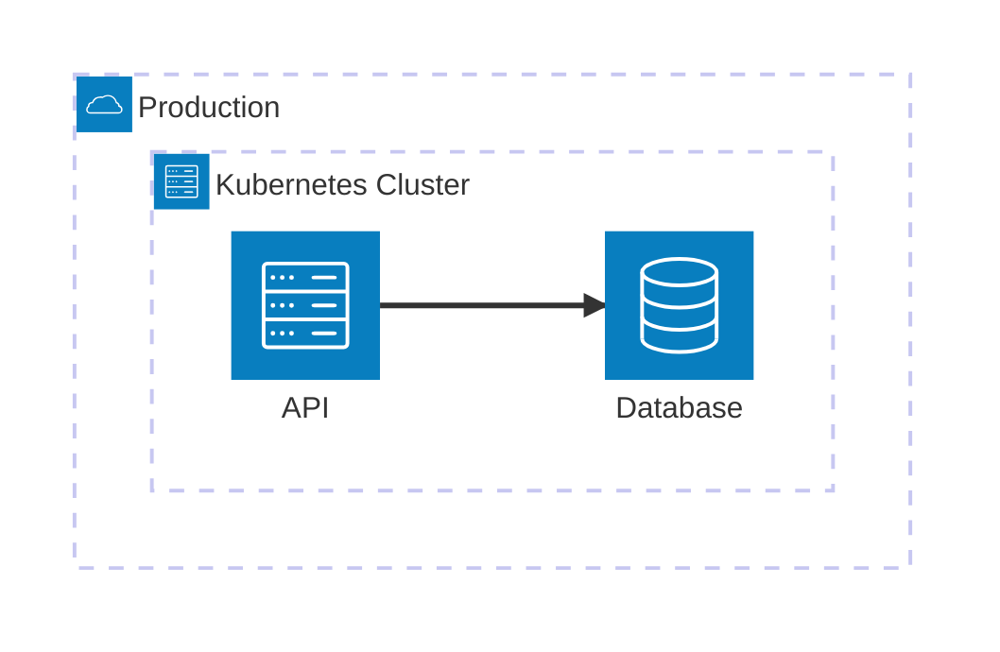

# Development Plan: arc42-language (feat/add-deployment-chapter-7 branch)

_Generated on 2026-09-01 by Vibe Feature MCP_
_Workflow: [epcc](https://codemcp.github.io/workflows/workflows/epcc)_

## Goal

Add first-class arc42 chapter-7 deployment modelling to the DSL. Authors should be able to describe
hierarchical infrastructure and environments, map software building blocks to one or more
infrastructure nodes, associate deployment diagrams with that model, and receive useful
cross-reference and consistency diagnostics without being forced to model deployment in workspaces
that do not use chapter 7.

## Key Decisions

- The primary structured element is `deployment-node`, following issue #6: `id` and `title` are
  required; `type`, `hosts`, and `parent` are optional. `hosts` is a comma-separated list of
  building-block IDs and `parent` references another deployment node.
- A chapter-5 `building-block` is a logical software responsibility or decomposition element. It
  is not automatically a process, container, binary, package, or other runtime artifact.
- The precise deployment relationship is `building-block --realized-by--> deployable-artifact
--deployed-to--> deployment-node`. A deployable artifact is the thing packaged and executed on
  infrastructure; it may realize one or more building blocks and may have multiple deployment
  variants.
- Issue #6's direct `deployment-node.hosts: building-block-id[]` is therefore an MVP shorthand for
  logical deployment coverage, not a complete artifact model. It must not imply that every logical
  building block is a separately deployable process.
- Deployment mappings are many-to-many. A building block may be hosted by several nodes and a node
  may host several building blocks or artifacts; the model must not impose one-node-only deployment
  semantics.
- Deployment completeness checks are opt-in: they run only when the workspace contains at least one
  deployment node. This keeps existing chapter-5-only workspaces free of chapter-7 warnings.
- Deployment hierarchy is distinct from building-block hierarchy. A deployment node's `parent` may
  resolve only to another deployment node, and a node cycle receives a new error code (`E009`), not
  issue #6's proposed `E007`, because `E007` is already assigned to duplicate solution strategies.
- `type: environment` is represented as an ordinary deployment node and can contain child nodes;
  no separate environment element is introduced in this feature. This models DEV/CI/TEST/PROD
  without duplicating the hierarchy mechanism.
- Deployment-node `hosts` references are indexed bidirectionally and exposed as `hosts` graph edges.
  `parent` references are exposed as `parent` edges, matching existing building-block navigation.
- `DeploymentNode` joins the existing `Element` union and workspace graph. Parallel collections would
  require a second ID/index/renderer/edge path and would make duplicate-ID and cross-reference
  behavior inconsistent.
- The first implementation uses issue #6's direct `deployment-node.hosts → building-block`
  shorthand. The explicit `deployable-artifact` layer is deferred until its packaging, realization,
  and variant semantics have a complete syntax and validation contract; the shorthand must be
  documented as logical deployment coverage rather than artifact-level proof.
- The first deployment mapping rule applies to deployable leaf building blocks: a composite
  building-block with children is a grouping element and is not required to appear in `hosts`.
  An unmapped leaf produces `W012` when deployment modelling is active.
- An empty leaf deployment node produces `H012`; a parent/container node with child deployment
  nodes is not considered empty merely because it hosts no software directly.
- Deployment diagrams use the existing explicit diagram-metadata-plus-fenced-source boundary rather
  than inferred heading proximity. The model gains explicit deployment ownership/root metadata and
  keeps diagram source raw; notation-specific parsing is bounded and must not be mixed into the
  deployment-node builder.
- The initial diagram integration validates ownership/root references and duplicate IDs. Mermaid or
  other deployment-notation semantics remain an adapter concern; arbitrary diagram source must not
  be treated as proof that every node or channel is present in the model.
- Infrastructure channels, locations, processors, storage, firewalls, and operational setup remain
  prose or diagram content for this increment. A future `deployment-channel` element can be added
  when a stable syntax and relationship contract are clear; inventing one now would make the node
  feature appear more complete than it is.
- Deployment diagrams are the second Code increment, after the node-model increment. The existing
  diagram validator is currently Runtime View/sequence-specific and rejects unsupported generic
  notations; implementing diagrams after the structured deployment model provides the authoritative
  IDs, hierarchy, and mappings that diagram validation needs. Increment 2 reuses the raw-artifact
  boundary and adds explicit root/ownership metadata plus a notation adapter.
- A deployment diagram is a named view of the deployment model, not another source of deployment
  truth and not an `Element`. It remains in `Workspace.diagrams`, while its `roots` references are
  resolved through the same workspace ID index as normal elements.
- Deployment diagrams use the existing explicit metadata block followed by one fenced source. The
  proposed metadata is `id` (required), `view: deployment` (required), `notation` (required), and
  optional `roots` (comma-separated deployment-node IDs). Without `roots`, the diagram is a
  workspace-level deployment overview; with one root it is a level-2 refinement; with several roots
  it is a selected multi-environment overview. This avoids forcing authors to maintain an exhaustive
  root list for ordinary overview diagrams.
- Diagram source does not create nodes, mappings, or channels. Model IDs and explicit safe aliases
  are references into the structured model; display labels are presentation-only. The model remains
  authoritative when prose, diagram, and block metadata disagree.
- Diagram validation is layered: common metadata/source bounds first, deployment-root references
  second, and notation-specific extraction last. A malformed or unsupported diagram must produce
  diagnostics without preventing validation of the rest of the workspace.
- The first deployment-diagram adapter may use Mermaid architecture diagrams because the project
  already has bounded Mermaid validation and Mermaid architecture syntax has explicit groups,
  services, junctions, and edges suitable for cloud/CI infrastructure. This is a view-level mapping,
  not a claim that Mermaid `group` is a complete deployment-node semantic. PlantUML deployment
  diagrams remain a separate future adapter because they have stronger deployment-specific
  vocabulary and nesting and would require a parser boundary from scratch.
- Mermaid deployment mapping convention: deployment nodes are represented by `group` declarations,
  hosted logical building blocks by `service` declarations, and infrastructure channels by edges or
  junctions. Stable identifiers should use model IDs where legal. If a notation-safe alias is needed,
  it must be declared explicitly in diagram metadata; implicit underscore-to-hyphen normalization is
  not sufficient because it can collapse distinct IDs.
- A deployment diagram with `roots` is a scoped view. The adapter may check that referenced groups,
  services, and edge endpoints exist and belong to the selected root subtrees. Without `roots`, it
  checks against the whole deployment model. It must not require every descendant to appear because
  diagrams are partial views by default.
- Diagram edges are not automatically converted into `interface` or future `deployment-channel`
  model edges. A logical interface and a physical/network channel answer different questions; their
  consistency can be checked only after both have explicit semantics.
- The first diagram diagnostics should keep the existing Runtime View `E008` contract intact and use
  a new deployment-specific `E010` for deployment-diagram metadata, model-reference, and bounded
  notation errors. A shared internal parser/validation utility may be extracted, but diagnostic code
  and rule metadata must remain chapter-accurate. Completeness hints for omitted descendants are
  deferred.
- The diagram metadata intentionally separates ownership from notation: `view: deployment` selects
  the architecture domain and `notation: mermaid-architecture` selects the source adapter. Existing
  Runtime View diagrams retain their `scenario`-based single-axis shorthand; retrofitting an explicit
  `view: runtime` is not required for this feature.
- Diagram-local aliases use an explicit `aliases` metadata field with unique `safe-id=model-id`
  entries. Aliases are optional when model IDs are legal in the selected notation; display labels are
  never aliases. A normalized or inferred alias is not accepted.
- Alias values use a dedicated key-value-list parse (`safe-id=model-id`), not the ordinary comma-list
  helper. Each entry must contain exactly one `=`, both sides must be non-empty, and duplicate safe
  IDs or duplicate model IDs are errors. Values containing `=` are not supported by this compact
  syntax.
- The existing Runtime View sequence adapter's underscore-to-hyphen normalization remains unchanged
  for this feature and is recorded as technical debt. Deployment aliases must not copy that implicit
  behavior; a future diagram-validation cleanup may migrate Runtime View to explicit aliases.
- Mermaid `service` declarations are also view-level shorthand for logical building-block coverage.
  They do not prove a one-to-one deployable artifact or independently running process, just as the
  structured MVP `hosts` field does not.
- Increment 2 validation keeps diagram metadata ownership in E010. Deployment diagram artifacts are
  retained as raw source plus explicit `view`, `roots`, and alias metadata; missing metadata is not
  silently converted into a partial model element by the builder.
- Deployment diagram IDs are checked across deployment and Runtime View diagram artifacts. E008
  remains responsible only for Runtime View notation validation, while E010 reports any collision
  involving a deployment diagram.
- E002 validates deployment `parent` and each `hosts` entry independently rather than inferring the
  relation from the flattened reference index. This preserves correct target-kind diagnostics when
  one ID is authored in both fields.

## Notes

- Official chapter 7 content: https://docs.arc42.org/section-7/
- Official tips reviewed: 7-1 through 7-10. The recurring themes are infrastructure nodes and
  channels, multiple environments, hierarchy, mapping building blocks to hardware, explaining node
  responsibility/characteristics/selection, and documenting operational prerequisites.
- Issue #6 proposes `deployment-node`, enum values `server | container | device | cloud-region |
environment`, `hosts`, `parent`, `W012`, `H012`, and a circular-parent error. Its intent is kept,
  but the error code is corrected to avoid the existing E007 collision and the completeness rules
  are refined for composite building blocks and opt-in activation.
- Arc42 explicitly permits m:n deployment mappings and says software architects only need to capture
  infrastructure relevant to the software architecture. Validation should therefore check declared
  relationships and obvious omissions, not prescribe hardware detail or a universal deployment
  topology.
- Arc42 tip 7-5 explicitly distinguishes source-level building blocks from the artifacts generated,
  compiled, or created from them. A deployment view should explain the mapping of those artifacts to
  hardware, including variants, rather than assume a one-to-one component-to-server relationship.
- Arc42 recommends diagrams, tables, and text together, including infrastructure level 1 and
  optional level-2 refinements. A deployment diagram should be able to identify a root node so a
  refinement can be linked to the corresponding hierarchy without parsing all visual notation.
- Existing diagram support is Runtime View-specific for sequence diagrams and otherwise stores raw
  artifacts. Chapter 7 should reuse that artifact boundary and avoid coupling deployment modelling
  to Mermaid syntax.
- Existing generic E002 checks existence, with special target-kind validation for runtime scenarios.
  Deployment references need the same target-kind treatment: `hosts` → `building-block`, `parent` →
  `deployment-node`.
- Existing chapter-7 prose is currently in `docs/arc42/07-deployment-view.md` and is not discovered
  because it is intentionally not an `.arc42.md` file. The implementation should add a starter DSL
  template without converting the project-specific prose into a typed document unless the final
  feature contract requires it.
- Existing code assignments are E001–E008, W001–W011, and H001–H011. New deployment rules must
  preserve monotonic, non-colliding codes.
- Critical review result: the plan was internally inconsistent about the model collection, artifact
  layer, and diagram scope. The reviewer recommends a coherent first increment: deployment nodes as
  elements, direct building-block mapping, typed references, hierarchy/completeness rules, graph
  edges, rendering, CLI/docs, and tests; deployment diagrams follow as Code Increment 2.
- Diagram design result: the diagram is an explicitly associated, scoped view with one or more
  deployment-node roots. The structured node model remains authoritative; adapters validate only
  bounded, explicit identifiers and relationships rather than attempting to infer architecture from
  arbitrary visual syntax.
- Critical diagram review result: roots should be optional for whole-model overviews; implicit alias
  normalization is unsafe; E008 cannot silently become a deployment rule because it is already a
  Runtime View rule; Mermaid group nesting must not be treated as deployment truth without an explicit
  consistency contract; and PlantUML support is a separate parser-sized feature.
- Final review result: prior design concerns are resolved, but the plan needed its example and task
  lists aligned with the decisions. E010 owns all deployment-diagram diagnostics; absent roots mean
  all deployment nodes/building blocks are in scope; explicit alias syntax must be shown; and parser,
  AST, chapter-7 metadata, edge-union, block-type, builder, renderer, and public-export changes are
  explicit prerequisites.
- Final adversarial review result: the remaining stale E008 task wording, implicit alias-parser
  assumption, and hidden compile-critical type extensions were corrected below. Diagram work is now
  explicitly grouped as Code Increment 2; the node-model increment owns E002/E009/W012/H012 and
  Increment 2 owns E010 and the deployment notation adapter.

## Explore

### Tasks

- [x] Read issue #6 and extract its proposed block, fields, diagnostics, and acceptance criteria
- [x] Read official arc42 chapter 7 content and practical tips 7-1 through 7-10
- [x] Inspect existing AST, model, builder, resolver, diagram, renderer, CLI, and validator seams
- [x] Compare deployment requirements with existing Runtime View diagram ownership and validation
- [x] Define cross-reference semantics, opt-in completeness behavior, and rule-code allocation
- [x] Clarify the relationship between logical building blocks, deployable artifacts, and deployment nodes
- [x] Decide the first implementation uses direct building-block-to-node shorthand and defers deployable artifacts
- [x] Define the deployment-diagram metadata syntax and supported root/reference checks as a follow-up design
- [x] Confirm the repository's own chapter-7 prose remains project-specific prose; add a separate starter DSL template rather than renaming it

### Completed

- [x] Created development plan file
- [x] Reviewed issue #6 and official arc42 section-7 guidance
- [x] Identified the deployment model as hierarchy + m:n building-block mapping, not a one-to-one host map
- [x] Identified the existing E007 code collision in the issue proposal
- [x] Defined diagram ownership as explicit metadata rather than inferred document structure
- [x] Clarified that deployment targets runtime artifacts derived from building blocks, while issue #6's direct mapping is only an MVP shorthand
- [x] Incorporated critical review: deployment nodes use the existing Element/index/edge pipeline; artifacts and deployment diagrams are deferred from the smallest coherent increment
- [x] Designed deployment diagrams as scoped, explicit views with `view: deployment`, `roots`, and notation adapters
- [x] Completed deployment-diagram ideation: metadata owns association/scope, structured elements remain authoritative, and notation adapters are bounded/read-only

### Findings

| Area                     | Finding                                                                                                                                                                         | Consequence                                                                                                                                                             |
| ------------------------ | ------------------------------------------------------------------------------------------------------------------------------------------------------------------------------- | ----------------------------------------------------------------------------------------------------------------------------------------------------------------------- |
| Chapter intent           | Chapter 7 describes infrastructure needed to execute the system and the mapping of software building blocks to it.                                                              | The structured model should focus on nodes, hierarchy, environments, and mapping; hardware inventory remains prose-friendly.                                            |
| Environments             | DEV, CI, TEST, and PROD may differ and should be documented separately.                                                                                                         | Model environments as typed/root deployment nodes so their child hierarchy and mappings remain queryable.                                                               |
| Hierarchy                | Arc42 recommends level-1 overviews and level-2 refinements of selected infrastructure elements.                                                                                 | `parent` must be a typed deployment-node reference, cycles are errors, and diagram roots can identify refinements.                                                      |
| Mapping                  | Arc42 describes deployment as an m:n mapping and specifically mentions artifacts derived from building blocks.                                                                  | `hosts` is a list, duplicate/multiple mappings are legal, and no uniqueness rule should be added.                                                                       |
| Channels                 | Infrastructure connections/channels matter, but the current issue contains no channel syntax and diagrams can represent them visually.                                          | Keep channels in prose/raw diagrams for this increment; track a future explicit channel model separately.                                                               |
| Node explanation         | Responsibility, technical characteristics, associated blocks, and selection reason are recommended.                                                                             | Keep `deployment-node` metadata small; encourage explanations through required prose association and optional future fields rather than unstructured key expansion now. |
| Operations               | OS, accounts, databases, middleware, network, firewall, certificates, and automation affect productive use.                                                                     | Do not turn operational checklists into node fields; document them in chapter prose and link decisions/constraints where structured IDs exist.                          |
| Diagrams                 | UML, free-form graphics, and tables are all valid forms; notation is not universal.                                                                                             | Store raw fenced sources and validate only explicit ownership/root references in the first deployment integration.                                                      |
| Existing workspaces      | Most repository documents contain building blocks but no deployment nodes.                                                                                                      | Deployment completeness diagnostics must be gated by deployment-node presence.                                                                                          |
| Composite blocks         | Building-block parents are decomposition/grouping elements, not necessarily deployable artifacts.                                                                               | W012 targets leaf building blocks by default to avoid false positives.                                                                                                  |
| Deployables              | A building block describes logical responsibility; an artifact is what is packaged/executed; a deployment node supplies infrastructure.                                         | Prefer `deployable-artifact.realizes` plus `deployment-node.hosts`; if deferred, document direct `hosts` as a constrained shorthand.                                    |
| Artifact variants        | One logical building block can produce multiple artifacts or deployment variants, and one artifact can bundle multiple building blocks.                                         | Do not enforce one artifact per building block, one node per artifact, or one environment per artifact.                                                                 |
| Model integration        | The existing workspace has one `Element` union, one ID index, and one edge pipeline; diagrams are a separate artifact collection.                                               | Deployment nodes belong in `Element`; do not create a parallel deployment-node collection.                                                                              |
| Diagram scope            | Existing generic diagrams are not yet semantically accepted by the validator, which is sequence-specific.                                                                       | Defer deployment diagrams until metadata ownership/root syntax and notation validation can be designed together.                                                        |
| Diagram role             | A diagram is a human-facing view and may be partial; the structured deployment model is the authoritative graph.                                                                | Validate explicit references and supported syntax, but do not infer missing model elements or create elements from diagram declarations.                                |
| Diagram scope            | One diagram may show the whole deployment model, one refined node, or several selected environment roots.                                                                       | Use optional comma-separated `roots`, rather than inferring ownership from headings or source order.                                                                    |
| Diagram scope ergonomics | Whole-model overview diagrams should not require an exhaustive list of environment roots.                                                                                       | Make `roots` optional; no roots means the complete workspace is the validation scope, while supplied roots narrow it.                                                   |
| Notation                 | Mermaid architecture syntax models groups/services/edges and fits the existing Mermaid adapter pattern; PlantUML offers richer deployment vocabulary but needs another adapter. | Design a notation-neutral artifact contract and implement Mermaid architecture first; keep PlantUML as a compatible future notation.                                    |
| Aliases                  | Replacing underscores with hyphens is lossy and can produce collisions.                                                                                                         | Require explicit, unique diagram-local aliases; never resolve human labels or infer aliases implicitly.                                                                 |
| Model-view consistency   | A deployment diagram can omit descendants intentionally, especially for level-2 refinement or overview diagrams.                                                                | Unknown/wrong-kind references are errors; omitted descendants are not errors without an explicit future completeness mode.                                              |
| Mermaid containment      | Mermaid `group`/`in` expresses visual organization but is not automatically identical to the deployment model's `parent`/`hosts` semantics.                                     | Validate declarations and references first; only validate group nesting against model hierarchy after a precise strict-containment contract exists.                     |
| Channels                 | Diagram edges may depict network or physical channels and do not necessarily represent software interfaces.                                                                     | Do not automatically map diagram edges to `interface` or invent channel elements as part of diagram support.                                                            |
| Diagnostic ownership     | E008 currently describes Runtime View sequence diagrams and has chapter-6 metadata.                                                                                             | Keep E008 for Runtime View; assign deployment-diagram diagnostics to E010 unless a later registry-wide diagnostic taxonomy deliberately generalizes E008.               |
| Diagram dispatch         | `view` selects the model domain and `notation` selects the source adapter; existing `scenario` metadata remains the Runtime View shorthand.                                     | Implement two-axis dispatch for deployment without forcing a Runtime View migration.                                                                                    |
| Alias contract           | Diagram-safe identifiers may differ from model IDs, but implicit normalization can collide.                                                                                     | Use explicit unique `aliases: safe-id=model-id` metadata entries and reject duplicate/ambiguous mappings.                                                               |
| Alias parsing            | Existing comma-list parsing does not parse key-value mappings or validate duplicate sides.                                                                                      | Add a dedicated exact-one-`=` key-value-list parser for deployment diagram aliases.                                                                                     |
| Runtime alias debt       | Runtime View currently performs implicit underscore-to-hyphen normalization.                                                                                                    | Leave it unchanged in chapter 7; record explicit-alias migration as follow-up technical debt.                                                                           |
| Logical service mapping  | Mermaid `service` visually resembles a concrete runtime service, while the MVP model maps logical building blocks directly.                                                     | Document `service` as logical deployment coverage, not artifact/process proof.                                                                                          |

### Proposed cross-reference graph

```text
deployment-node --parent--> deployment-node
deployment-node --hosts--> building-block  (MVP logical-coverage shorthand)
deployment-diagram --roots--> deployment-node
```

All edges are optional in the syntax, but when present they must resolve to the target kind above.
The future artifact-aware graph is `deployable-artifact --realizes--> building-block` and
`deployment-node --hosts--> deployable-artifact`; it is intentionally outside the first increment.
MVP diagnostics must describe direct `hosts` mapping as logical coverage, not artifact-level
deployment completeness.
The resolver and `get` API should expose the same IDs and edge relations so validation and querying
cannot disagree about the graph.

### Candidate checks

| Code | Severity | Candidate rule                                                                                        | Decision                                                                                                                                                         |
| ---- | -------- | ----------------------------------------------------------------------------------------------------- | ---------------------------------------------------------------------------------------------------------------------------------------------------------------- |
| E002 | error    | `hosts`, `realizes`, or `parent` points to a missing/wrong-kind element                               | Reuse the generic unresolved-reference rule with deployment-specific target-kind messages.                                                                       |
| E009 | error    | Deployment-node parent chain contains a cycle                                                         | Implement as a deployment-specific hierarchy check; do not reuse E003 because that rule is building-block-specific.                                              |
| E010 | error    | Deployment diagram metadata, model references, or bounded notation is invalid                         | Use for all deployment-diagram validation layers; keep Runtime View E008 unchanged. At minimum, edge endpoints must resolve to declarations in the same diagram. |
| W012 | warning  | A deployable leaf building block is not mapped to infrastructure while deployment modelling is active | Recommended for the MVP shorthand; composite logical blocks with children are exempt.                                                                            |
| H012 | hint     | Leaf deployment node hosts no building block and has no child deployment nodes                        | Recommended; parent/grouping nodes are exempt.                                                                                                                   |
| H013 | hint     | Deployment diagram root has no corresponding refinement/host detail                                   | Defer; this would confuse documentation completeness with architecture correctness.                                                                              |
| H014 | hint     | A deployed node has no prose explaining responsibility or relevant characteristics                    | Defer until heading/block ownership validation can distinguish intentional terse documentation.                                                                  |

The node-model implementation should start with E002/E009/W012/H012. The later diagram increment
should start with E010 root/reference and notation-adapter checks. H013 (omitted descendants) and
H014 (missing node prose) remain deliberately deferred.

### Deployment diagram design sketch

````markdown
:::diagram
id: prod-infrastructure
view: deployment
notation: mermaid-architecture
roots: env-prod
aliases: env_prod=env-prod, prod_cluster=prod-cluster, bb_api=bb-api, bb_db=bb-db
:::


````

```

The metadata owns association, scope, and safe-ID mapping. The source provides a view of selected
deployment nodes, logical building blocks, and channels. An overview can use `roots: env-prod, env-test`;
a refinement can use one root such as `roots: prod-cluster`. The source must use stable IDs or the
explicit safe aliases declared in metadata, while human labels remain presentation text. Omitting
`roots` means the diagram is scoped to the whole deployment model.

### Proposed diagram validation layers

1. **Common artifact checks** — required metadata, duplicate diagram IDs, bounded source size, and a
   supported notation declaration. These checks may share implementation utilities with Runtime View
   diagrams but do not reuse E008's deployment-facing metadata.
2. **Deployment model checks** — when `roots` is present, every root ID resolves to a
   `deployment-node`; when `roots` is absent or empty, the whole deployment model is in scope. Every
   explicitly mapped model ID resolves to the expected `deployment-node` or `building-block` kind;
   all selected roots and aliases are unique.
3. **Notation adapter checks** — Mermaid declaration uniqueness, group/service nesting, edge endpoint
   declarations, and explicit alias resolution. PlantUML can implement an equivalent adapter later.
4. **Scoped consistency checks** — when roots are supplied, referenced model elements must be within
   a selected root subtree; without roots, the whole deployment model is in scope. Missing descendants
   are allowed because diagrams are partial. A future completeness mode is not part of this contract
   and must be designed separately rather than assumed here.

The adapter must never treat display labels, icon names, layout directives, or arbitrary edge labels as
architecture IDs. It should return bounded intermediate declarations and diagnostics, not mutate the
workspace. At minimum, every diagram edge endpoint must resolve to a declaration in the same diagram;
this checks diagram integrity without claiming that the edge is a structured deployment channel.

## Plan
### Tasks
- [x] Finalize the `deployment-node` field contract and enum validation
- [x] Decide and document the explicit deployable-artifact layer versus direct building-block mapping
- [x] Define the Code Increment 2 deployment-diagram metadata/root/alias syntax and AST/model boundary
- [x] Define rule behavior for composites, empty roots, inactive deployment workspaces, and m:n maps
- [x] Specify focused acceptance tests for builder, resolver, validator, renderer, CLI, and templates
- [x] Review the plan critically before implementation

### Completed
- [x] Confirmed that no repository requirements, architecture, or design document exists under
  `.vibe/docs`; this plan is the governing requirements/design record for the increment.
- [x] Chosen first-increment scope: structured deployment nodes, hierarchy, direct logical
  building-block mapping, validation, graph edges, rendering, CLI/docs, starter template, and tests.
- [x] Assigned deployable artifacts and channels to future work, and assigned deployment diagrams
  and notation parsing to Code Increment 2 after the node-model foundation is complete.

### Implementation strategy

#### Increment 1: deployment-node model

1. **Syntax and model contract**
   - Extend the AST block-type union and known-block dispatch with `deployment-node`.
   - Parse `id` and `title` as required scalar attributes. Parse optional `type` as exactly one of
     `server`, `container`, `device`, `cloud-region`, or `environment`.
   - Parse optional `hosts` as a trimmed comma-separated list of building-block IDs and `parent` as
     one deployment-node ID, using the repository's existing attribute/list conventions.
   - Preserve IDs as authored; do not normalize, infer, or resolve display titles as identifiers.
     Invalid enum values and malformed required attributes must use the existing builder/parser
     diagnostic path rather than creating a partially valid element.
   - Add `DeploymentNode` to the existing `Element` union. Do not introduce a second workspace
     collection or a second ID namespace.

2. **Chapter and type-system integration**
   - Add chapter `7` to `Arc42Chapter`, chapter titles, element chapter maps, element ordering, CLI
     chapter metadata, and any exhaustive unions.
   - Add the deployment node to `ElementRenderers` and all renderer dispatches. Add `hosts` to the
     edge relation union before implementing graph construction so type errors expose missed seams.
   - Export the public deployment-node type and preserve existing ordering for all non-deployment
     elements.

3. **Reference indexing and graph construction**
   - Index `parent` and each `hosts` target through the existing resolver/index path, retaining the
     source element and field/relation needed for diagnostics and reverse navigation.
   - Emit `parent` edges from child deployment nodes to their deployment-node parents and `hosts` edges
     from deployment nodes to building blocks. Preserve m:n mappings; do not enforce uniqueness or
     collapse distinct source relations.
   - Ensure `get`/resolver behavior, validation, and graph edges use the same ID index and target-kind
     rules.

4. **Validation and diagnostic ordering**
   - Extend E002 with target-kind checks: `hosts` must resolve to `building-block`; `parent` must
     resolve to `deployment-node`. Missing and wrong-kind references remain errors.
   - Add E009 for every deployment-parent cycle, including self-cycles and cycles longer than two
     nodes. A missing parent is reported by E002, not by the cycle rule.
   - Activate deployment completeness checks only when at least one deployment node exists.
     Otherwise, existing workspaces receive no new deployment warnings or hints.
   - Add W012 for each unmapped leaf building block; building blocks with children are exempt.
     Multiple hosts are valid, and one host may map multiple leaves. Do not report a leaf that is
     mapped at least once, even if it is also present under several nodes.
   - Add H012 only for a leaf deployment node with no direct `hosts` mapping and no child deployment
     nodes. A deployment node that has children is a grouping/container node even when it hosts no
     software directly; an environment node follows the same rule.
   - Keep diagnostics deterministic: traverse elements in the existing model order and references in
     authored list order, then apply the existing diagnostic sorting convention.

5. **Rendering and repository-facing documentation**
   - Render deployment nodes with their title, optional type, parent, and hosts in the existing text
     representation; render IDs and references consistently with other elements.
   - Update CLI block/chapter metadata, public README block tables, skill guidance, and add the starter
     `07-deployment-view.arc42.md` without renaming or absorbing the existing project-specific
     `docs/arc42/07-deployment-view.md` prose.

6. **Verification sequence**
   - Add focused tests before or alongside each seam: builder parsing/invalid fields, resolver
     indexing, E002 target kinds, E009 cycles, W012/H012 activation and exemptions, graph edges,
     text rendering, CLI metadata, starter-template presence, and public exports.
   - Add an integration scenario covering a hierarchy, an environment node, an m:n mapping, a
     composite building block, and an inactive workspace with no deployment nodes.
   - Run targeted core tests first, then package type checks/build and the repository's full test and
     source/docs validation commands.

#### Code Increment 2: deployment diagrams

Increment 2 starts after Increment 1 has produced and verified the structured deployment model,
resolver index, graph edges, and baseline validation. It is a separate implementation slice in the
same Code phase, not an optional or abandoned feature. It must follow this order:

1. Extend diagram metadata/AST/parser dispatch with required `id`, `view: deployment`, required
   `notation`, optional comma-separated `roots`, and optional `aliases`.
2. Parse aliases with a dedicated key-value-list helper: each comma-separated entry must contain
   exactly one `=`, both sides must be non-empty, and safe IDs and model IDs must each be unique.
3. Resolve roots and mapped IDs through the existing workspace index; absent or empty roots mean the
   entire deployment model, while supplied roots restrict references to their selected subtrees.
4. Add E010 for deployment-diagram metadata, model-reference, and bounded notation-adapter errors;
   retain E008 exclusively for Runtime View. Keep adapters read-only and do not create model elements
   from diagram source.
5. Implement Mermaid architecture as the first adapter. Treat `group` and `service` declarations as
   view-level deployment-node/logical-building-block shorthand, not proof of artifact identity,
   process boundaries, or physical channels. Require every diagram edge endpoint to name a declaration
    in that same diagram. Leave PlantUML and completeness hints for later work.

Increment 2 acceptance requires that valid deployment metadata is parsed into the existing diagram
collection; roots resolve to deployment nodes; aliases resolve only through explicit unique mappings;
unknown or wrong-kind model references produce E010; malformed or unsupported notation produces
diagnostics without aborting unrelated workspace validation; Mermaid declarations and edge endpoints
are checked; partial diagrams remain valid; and Increment 1 behavior remains regression-free.

### Design options considered

| Decision point | Alternatives considered | Selected option and rationale |
| --- | --- | --- |
| Deployment-node storage | Separate deployment collection; existing element graph | Existing `Element` union and workspace index, preserving one ID/reference/edge pipeline. |
| MVP mapping | Model deployable artifacts immediately; map nodes directly to building blocks | Direct `hosts` shorthand now; artifact semantics are deferred until their syntax and validation are complete. |
| Completeness activation | Warn in every workspace; require an explicit mode; activate on deployment nodes | Activate when at least one deployment node exists, avoiding chapter-7 noise in existing workspaces. |
| Leaf coverage | Require every building-block element; require only leaves; require exactly one host | Require each leaf to have at least one mapping; composites are grouping elements and m:n mappings remain legal. |
| Diagram association | Infer from heading/source proximity; explicit metadata | Explicit metadata with `view`, `notation`, optional `roots`, and aliases, keeping raw source and model authority separate. |
| Diagram identifiers | Normalize IDs; resolve display labels; explicit aliases | Explicit unique aliases only; normalization and label inference are unsafe. |
| Diagram diagnostics | Reuse E008; create deployment-specific E010 | E010 owns deployment diagnostics; E008 remains the Runtime View rule. |

### Acceptance matrix

| Area | Required acceptance case |
| --- | --- |
| Builder | Minimal node, every optional field, comma-separated hosts, all valid enum values, missing id/title, invalid type, and whitespace handling. |
| Model/chapter | Node is in `Element`, chapter is `7`, ordering/title maps are complete, and public type exports compile. |
| Resolver | Parent and hosts references are indexed; missing IDs and wrong target kinds are distinguishable. |
| Validator | E002 for missing/wrong-kind refs; E009 for self/multi-node cycles; W012/H012 only under the stated activation and leaf/container rules. |
| Mapping semantics | Several nodes may host one leaf, one node may host several leaves, duplicate authored mappings do not create false uniqueness errors, and composites are exempt from W012. |
| Graph | `parent` and `hosts` relations are emitted with correct direction and relation types; reverse lookup remains consistent. |
| Renderer | Deployment nodes and optional fields render deterministically without breaking existing element output. |
| Regression | A workspace without deployment nodes has no new deployment diagnostics and all existing chapter/runtime tests remain green. |
| Repository support | CLI metadata, README, skill guidance, starter template, and existing project-specific chapter-7 prose are all correct. |
| Code sequencing | Implement diagrams with the node model; postpone diagrams indefinitely | Complete and verify the structured node model as Increment 1, then implement diagrams as Code Increment 2 over that model. |
| Increment 1 boundary | Include diagram parsing immediately; document diagrams without implementing them | Increment 1 excludes diagram parsing and E010, while Increment 2 is explicitly part of the planned Code work. |
| Increment 2 authority | Treat diagram source as architecture truth; accept arbitrary raw notation | Keep the structured model authoritative, validate explicit metadata/references, and use bounded notation adapters. |

## Code
### Tasks
- [x] **Increment 1 — model:** Add `deployment-node` to `BlockType`, `KNOWN_BLOCK_TYPES`, the builder, the `Element` union,
  `ELEMENT_KIND_ORDER`, `ELEMENT_CHAPTER`, `CHAPTER_TITLE[7]`, the `Arc42Chapter` union, public
  exports, and all exhaustive renderer/element-renderer branches
- [x] **Increment 1 — graph:** Add deployment references to the resolver and E002 target-kind checks (`hosts` →
  `building-block`, `parent` → `deployment-node`); add the `hosts` member to `Edge.relation`, graph
  edges, and text rendering
- [x] **Increment 1 — validation:** Add E009, W012, and H012; keep E010 out of this increment
- [x] **Increment 1 — documentation:** Update CLI block/chapter metadata, README, skill guidance, and
  starter template
- [x] **Increment 1 — verification:** Add focused and integration tests, then verify the complete node
  model before starting Increment 2

### Code Increment 2 — deployment diagrams
- [x] Extend diagram metadata/AST/parser dispatch for `view: deployment`, required `notation`, optional
  `roots`, and explicit diagram-local aliases; add the dedicated key-value-list alias parser
- [x] Add deployment diagram ownership/root/alias handling and the E010 rule behind a notation-adapter
  boundary; keep E008 exclusively for Runtime View
- [x] Implement Mermaid architecture adapter checks for group/service declarations, scoped model
  references, declaration-local edge endpoints, and logical service/group mapping semantics
- [x] Add Increment 2 parser, resolver, E010, adapter, scope, malformed-input, and regression tests
- [x] *(resolved — closed [#10](https://github.com/mrsimpson/arc42-language/issues/10))* Migrate Runtime View's implicit identifier normalization to explicit aliases

### Completed
- Increment 1 review completed. The review found and the implementation fixed the CLI chapter-7 help
  omission, clarified E002 messaging when `parent` and `hosts` share an ID, and added self-cycle and
  many-to-many mapping tests.
- The review identified accidental Increment 2 deployment-diagram scaffolding. It was removed from the
  Increment 1 code path; deployment diagram parsing, metadata, aliases, E010, and adapters remain
  exclusively assigned to Code Increment 2.
- The review also identified repository-wide formatter changes and a local test-runner/environment
  concern. These are recorded as validation caveats; unrelated working-tree changes must not be
  folded into the feature implementation.

## Commit
### Tasks
- [x] Run targeted tests, type checks, build, source/docs validation, and the full ready check
- [x] Conduct final review of the diff and acceptance criteria
- [ ] Commit only after explicit user request

### Completed
- Increment 1 review completed. The review found and the implementation fixed the CLI chapter-7 help
  omission, clarified E002 messaging when `parent` and `hosts` share an ID, and added self-cycle and
  many-to-many mapping tests.
- Removed accidental deployment-diagram AST/parser/builder/E008 scaffolding from Increment 1. Diagram
  parsing and validation remain exclusively assigned to Code Increment 2.
- The remaining repository-wide formatter changes are unrelated working-tree noise and must not be
  folded into the feature implementation.
- Increment 1 verification now passes for core formatting/type checks, all 113 core tests, and the
  core package build. CLI verification is run sequentially after the core build because the workspace
  package export resolves through the generated core declaration/output files.
- Increment 2 review completed. Fixed cross-type diagram-ID collisions, preserved E010 ownership of
  deployment metadata, made E002 field-role validation independent, clarified unscoped mapping
  diagnostics, and added malformed metadata, duplicate declaration, nesting, scope, and regression
  tests.
- Full implementation verification passes: `pnpm ready` (check + test + build) passes. 126 tests,
  `arc42 validate` on both docs and examples workspaces clean.
- Project deployment view added (`docs/arc42/07-deployment-view.arc42.md`) with three deployment
  nodes, whole-model overview diagram, and scoped refinement diagram.
- Skill refactored to remove all chapter-number references; diagram guidance is concise and
  notation-agnostic, deferring notation detail to starter templates.
- Starter template updated to recommend the overview-first diagram structure.


---
*This plan is maintained by the LLM. Tool responses provide guidance on which section to focus on and what tasks to work on.*
```
