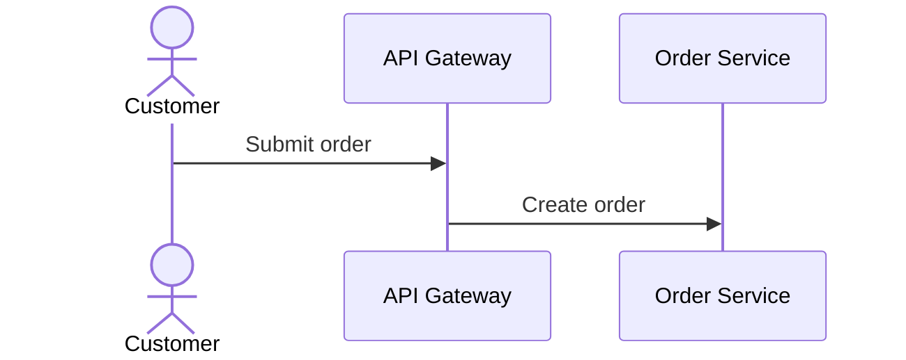
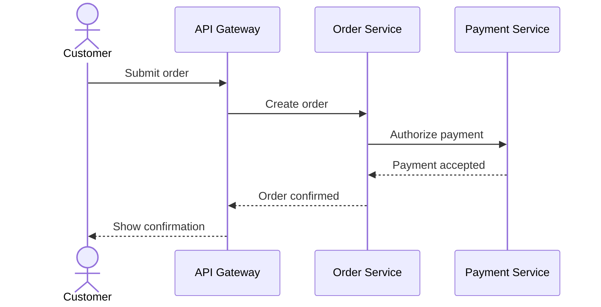
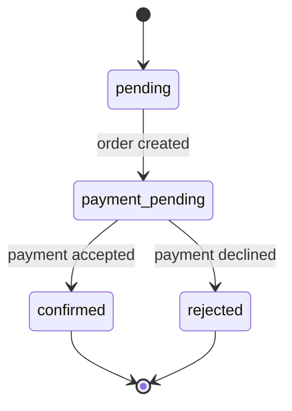

# Development Plan: arc42-language (feat/add-runtime-scenario-block branch)

_Generated on 2026-09-01 by Vibe Feature MCP_
_Workflow: [epcc](https://codemcp.github.io/workflows/workflows/epcc)_

## Goal

Support a new `runtime-scenario` block type for arc42 chapter 6 (Runtime View) across the model, resolver, validation, rendering, CLI, and documentation, including validation of Mermaid sequence diagrams attached to those scenarios.

The block represents runtime scenarios as structured, cross-referenceable elements without changing the existing Markdown prose and `:::block` syntax.

## Key Decisions

- The parser intentionally remains open-ended and emits unknown block types as raw `blockType` strings. Known block types are registered by the model builder.
- The model uses typed `Element` variants with `kind`, `id`, `title`, and `loc`; the new type must be added consistently to `BlockType`, `Element`, the builder, and public exports.
- Canonical chapter mapping is maintained by `ELEMENT_KIND_ORDER`, `ELEMENT_CHAPTER`, and `CHAPTER_TITLE`. `runtime-scenario` belongs to chapter 6 and is ordered between chapters 5 and 8.
- References are indexed bidirectionally and exposed as graph edges by `get`; the new reference contract must therefore be implemented consistently in the builder, resolver, and edge generation.
- JSON renders elements generically. The text renderer requires explicit handling for workspace rows and single-element views.
- The CLI maintains its own allowed block-type list and chapter-name list; both must be extended.
- Issue #5 defines the feature contract: `runtime-scenario` belongs to chapter 6, requires `id` and `title`, and optionally supports `involves` (comma-separated building-block IDs) and `trigger` (free text).
- `involves` is represented as `string[]`. Missing, empty, or whitespace-only values become `[]`, consistent with existing list fields; references are indexed by the existing resolver.
- A runtime scenario covers an interface when it includes all building-block endpoints of that interface. For an actor↔building-block interface, including the building block is sufficient because the external actor is described by the trigger and scenario prose.
- The usual Runtime View artifact is a small, architecturally relevant scenario section: a title, a textual or diagrammatic description of the flow, and an explanation of notable interactions between participating building-block instances.
- Common scenario notations are numbered prose steps, activity diagrams/flowcharts, sequence diagrams, BPMN/EPCs, and state machines. Arc42 does not require one notation; the choice depends on the audience and scenario.
- Runtime View scenarios commonly cover important use cases, critical external-interface interactions, operational/administrative flows such as startup and shutdown, and error/exception paths. Only a representative selection is expected.
- The structured block will therefore not attempt to encode sequence steps, diagram syntax, or a full workflow graph in this issue. `title`, `trigger`, and `involves` provide the machine-readable index; Markdown prose carries the scenario narrative and diagrams may remain embedded or referenced there.
- Diagram validation is a separate concern from scenario metadata: the diagram source is parsed into a notation-specific intermediate representation, then common semantic checks and cross-reference checks run against that representation.
- The validator must not infer diagram ownership from arbitrary heading proximity. A diagram-to-scenario association should be explicit, either through a diagram metadata block or an explicit scenario identifier attached to the diagram fence.
- Mermaid sequence diagrams are the only diagram notation in scope for this feature because they are commonly embedded in Markdown and expose explicit participants and message endpoints; state diagrams, PlantUML, and other notations remain future scope behind the adapter boundary.
- Diagram validation is staged: syntax/grammar diagnostics first, notation-specific semantics second, and cross-reference/architecture consistency third. A malformed diagram must not cause crashes or suppress validation of other files.
- The initial semantic scope is deliberately conservative: sequence diagrams must declare participants before use and may only reference declared/involved architectural participants. Reachability, message completeness, and domain-specific behavioral correctness are hints or future scope, not claims made by this validator.
- Mermaid sequence participants should use a stable, lintable model reference as their identifier or explicit annotation and a separate human-readable alias for display, for example `participant bb_api as API Gateway`. The validator resolves `bb_api` through a normalization/alias map to the model ID `bb-api` where needed; labels are never used as references.
- The canonical association is an explicit arc42 diagram metadata declaration containing model references; Mermaid-native participant identifiers/aliases are a convenience that the adapter can extract. Mermaid comments may carry optional source annotations, but comments alone are not the required semantic contract because Mermaid treats them as non-rendered text.
- State diagrams are explicitly out of scope for parsing and linting in this change. They may remain in Markdown Runtime View content, but the tool must not claim to validate their syntax, states, transitions, or model mappings.
- Unsupported state diagrams remain ordinary Markdown/code-fence content and are not diagnostics by themselves; only an explicitly declared diagram using an unsupported notation may receive an unsupported-notation diagnostic.
- Runtime scenarios are not singletons: chapter 6 may contain multiple independent scenarios, each in its own prose section and block.
- `involves` references use a dedicated `involves` graph-edge relation rather than `addresses`; this preserves the distinction between runtime participation and traceability to quality goals.
- A non-existent `involves` target and an existing target of the wrong kind both violate the field contract and must be reported as E002-compatible reference errors; only building blocks are valid targets.
- W011 is a warning for each runtime scenario without participating building blocks (`involves` missing or empty). H011 is a hint for each interface not covered by any runtime scenario. Both are best-practice diagnostics and do not make `ValidateResult.valid` false.
- The `06-runtime-view.arc42.md` starter file remains entirely inside an HTML comment like the other starter templates; copying it unchanged produces no elements or diagnostics.
- No `.vibe/docs/requirements.md` exists; requirements are documented here from Issue #5 and the existing architecture.

## Notes

- Existing block types are `quality-goal`, `constraint`, `actor`, `solution-strategy`, `building-block`, `interface`, `concept`, `decision`, `risk`, and `glossary-term`.
- The existing `solution-strategy` block is the closest structural comparison: it has `id`, `title`, and an optional comma-separated list field.
- The builder validates `id` and `title` generically. Type-specific fields and enumerations are validated in the corresponding dispatch branch.
- `buildWorkspace` collects elements and parse errors but does not enforce workspace cardinality; structural rules are registered in the validator.
- `buildIndex` currently indexes references from `building-block`, `interface`, `decision`, and `solution-strategy`. Runtime-scenario `involves` references must be added there.
- Relevant tests are in `packages/core/tests/builder.test.ts`, `validator.test.ts`, `renderer.test.ts`, and `parser.test.ts`, plus CLI smoke checks.
- Documentation touchpoints include `README.md`, `packages/skill/SKILL.md`, and `templates/starter/`.
- The `feat/add-runtime-scenario-block` branch was created before implementation work began.
- `docs/arc42/06-runtime-view.md` documents the project's agent-driven architecture-evolution flow and is intentionally kept as a project architecture document rather than a starter-template reference.
- Existing architecture documentation explicitly identifies chapter 6 as not yet typed. This feature is the first structured extension of that chapter; prose remains the place for detailed flow descriptions.
- Issue #5 explicitly requires E002 for an unknown `involves` ID. Because the existing generic E002 only checks whether an ID exists, implementation must also ensure that `involves` targets a `building-block`, while preserving E002-compatible diagnostics.
- `Arc42Chapter` currently does not include chapter 6 and must be extended so W011/H011 are available through `arc42 rules --chapter 6`.
- There is currently no diagram parser, diagram AST, diagram fixture, or repository-wide notation convention. This extension therefore requires a small adapter boundary rather than embedding Mermaid-specific logic in the validator.
- The implemented diagram authoring syntax is a `:::diagram` metadata block followed by the next fenced Markdown source. Metadata requires `id`, `scenario`, and `notation`; the parser stores the fence source verbatim as a diagram AST node. This keeps scenario ownership explicit without putting multiline Mermaid text into block attributes.
- Diagram artifacts are stored on `Workspace.diagrams` rather than in the `Element` union. They are validated by E008 and do not participate in element graph edges; `runtime-scenario.involves` remains the architecture graph contract.
- E008 is an error for malformed or explicitly unsupported associated diagrams. State-diagram source is never parsed as a state machine: only a declared `notation: mermaid-state` artifact receives the unsupported-notation diagnostic.
- Mermaid sequence validation is intentionally a bounded subset parser: source is limited to 64 KiB and 1000 lines, requires `sequenceDiagram`, checks declarations/messages, normalizes `_` aliases to `-` model IDs, and treats `actor` declarations as external participants.
- The bounded Mermaid subset explicitly covers `->>`, `-->>`, `->`, `-->`, `-x`, `--x`, `-)`, and `--)` message arrows, including activation markers before a target; message parsing must keep arrow suffixes out of endpoint identifiers. Notes, activation commands, grouping keywords, quoted participant forms, and renderer-specific semantics remain opaque source content and are not claimed to be validated.
- `Workspace.diagrams` is required and defaults to an empty array from every workspace builder/caller. This prevents accidental omission from silently disabling diagram validation.
- Runtime-scenario authoring details belong in the chapter-6 starter-template comments, not in the general agent skill. The skill documents only the cross-cutting diagram annotation convention: explicit metadata ownership, notation, stable model identifiers, and presentation aliases.
- `docs/arc42/06-runtime-view.md` is the project's own Runtime View and must describe the agent-driven architecture-evolution flow using the project's actual chapter-3 actors and chapter-5 building blocks; generic checkout examples belong in the starter guidance or plan examples, not in this project architecture document.
- The general skill intentionally does not document `runtime-scenario` fields, W011, or H011; those are chapter-specific authoring details provided by the chapter-6 starter-template comments. The skill only documents the reusable diagram association and identifier convention.
- The project Runtime View models the architect as the primary reader/editor of the workspace. Validation is a quality gate invoked implicitly by the pre-commit hook or CI/merge-request pipeline, not a routine manual architect interaction.
- The representative scenario set is intentionally schematic: the agent-evolution scenario covers the external workflow, while the core validation-pipeline scenario covers parser→builder, builder→resolver, resolver→validator, and validator→renderer. H011 coverage must be achieved by one scenario containing both building-block endpoints of each interface.
- Follow-up bug filed as GitHub issue #8: add structural validation for required top-level arc42 chapter `h1` headings and scenario/element `h2` hierarchy. This is deferred from the runtime-scenario implementation; the current W004/W005 rules do not validate heading levels or chapter headings.
- The `DiagramNode`/`Diagram` AST and model remain notation-independent: `source` is raw fenced text and `notation` selects a future adapter. Runtime View ownership is intentionally present only on `SequenceDiagramNode`/`SequenceDiagram`; it does not encode Mermaid participants or messages. Mermaid participants/messages belong only in the adapter's intermediate representation and validator.
- Refined the diagram model after review: `Diagram` is now the abstract generic artifact contract (`id`, `notation`, raw `source`, and location); `GenericDiagram` and `SequenceDiagram` form a discriminated union. Only `SequenceDiagram` carries the Runtime View `scenario` association. This leaves room for package, deployment, and other diagrams that have no scenario or source-span-specific fields.
- Reviewer correction applied: `DiagramNodeBase` no longer contains `scenario`, so `GenericDiagramNode` extends it directly without `Omit`. `SequenceDiagramNode` adds `scenario`; the AST and model hierarchies now express the same subtype relationship and remain open to package/deployment diagram variants.

## Explore

### Tasks

- [x] Investigate existing AST, model, builder, resolver, validator, renderer, and CLI extension points
- [x] Identify existing tests and documentation touchpoints for block types
- [x] Confirm the `runtime-scenario` attribute and reference contract from Issue #5
- [x] Define W011 and H011 behavior from the acceptance criteria
- [x] Research the usual arc42 Runtime View artifacts and decide what remains prose/diagram content

### Completed

- [x] Created development plan file
- [x] Documented the existing architecture and extension points
- [x] Reviewed Issue #5, Runtime View documentation, and existing chapter/rule conventions
- [x] Documented requirements, reference semantics, and W011/H011 behavior
- [x] Documented the Runtime View artifact boundary: scenario metadata is structured, detailed flow notation remains prose or an external/embedded artifact

### Findings

| Area                 | Finding                                                                                                                                                                                                         | Consequence                                                                                                                                                                                        |
| -------------------- | --------------------------------------------------------------------------------------------------------------------------------------------------------------------------------------------------------------- | -------------------------------------------------------------------------------------------------------------------------------------------------------------------------------------------------- |
| Domain scope         | Chapter 6 describes architecturally relevant flows and interactions between building blocks; exhaustive sequence modeling is not required.                                                                      | A flat scenario element with metadata and references is sufficient for Issue #5; detailed flows remain Markdown prose.                                                                             |
| Block contract       | `id` and `title` are required; `involves` and `trigger` are optional.                                                                                                                                           | `RuntimeScenario` gets `involves: string[]` and `trigger?: string` alongside `kind` and `loc`.                                                                                                     |
| References           | `involves` references building-block IDs and must resolve bidirectionally.                                                                                                                                      | The builder uses `splitList`; the resolver and `get` expose the existing reference information/edges. Unknown or invalid targets must surface as E002-compatible errors.                           |
| W011                 | A scenario without `involves` is structurally allowed but disconnected from the building-block model.                                                                                                           | Emit one warning per empty scenario; do not affect `valid`.                                                                                                                                        |
| H011                 | An interface is covered when a scenario includes all relevant building-block endpoints.                                                                                                                         | Emit one hint per uncovered interface; do not affect `valid`.                                                                                                                                      |
| Chapter/CLI metadata | Chapter 6 is currently absent from `Arc42Chapter`, chapter titles, CLI help, and block-type filters.                                                                                                            | Add chapter 6 and `runtime-scenario` to all relevant metadata lists.                                                                                                                               |
| Documentation        | `docs/arc42/06-runtime-view.md` is currently prose-only; starter files are commented authoring guidance.                                                                                                        | Add the starter template and update project/skill documentation without replacing the existing workflow prose.                                                                                     |
| Runtime artifacts    | Arc42 accepts numbered steps, activity/flow diagrams, sequence diagrams, BPMN/EPCs, and state machines; it recommends a few representative, architecturally relevant scenarios rather than exhaustive coverage. | Keep the block notation-agnostic. Store only scenario identity, trigger, and participating building blocks; leave steps, notable interactions, and diagrams in Markdown prose or linked artifacts. |
| Diagram capability   | No existing diagram syntax or ownership convention is present in the repository.                                                                                                                                | Introduce an explicit diagram artifact representation and notation adapter boundary; do not parse arbitrary prose or infer ownership from heading order.                                           |
| Notation choice      | Mermaid is Markdown-native and supports the requested sequence-diagram family; PlantUML and state-diagram validation have no current project implementation or requirement.                                     | Implement Mermaid sequence validation first behind a generic adapter interface; defer state diagrams, PlantUML, and other notations.                                                               |
| Validation depth     | Diagram languages allow syntax, structural, and domain-specific checks with different confidence levels.                                                                                                        | Keep syntax and referential integrity actionable; classify reachability/completeness/style checks as warnings or hints and avoid pretending to prove runtime correctness.                          |
| Model annotations    | Mermaid sequence diagrams support participant identifiers and aliases that can carry stable component references; state diagrams have no in-scope model annotation contract.                                    | Use IDs/aliases for sequence participants and never infer model references from display labels. Defer state-to-component mappings with state-diagram validation.                                   |

### Acceptance criteria from issue #5

- [x] A workspace with valid `runtime-scenario` blocks validates without errors.
- [x] An unknown or invalid `involves` target produces an E002-compatible diagnostic.
- [x] A scenario without `involves` produces W011.
- [x] An interface not covered by any scenario produces H011.
- [x] The new starter template produces 0 errors and 0 warnings unchanged.
- [x] A valid sequence diagram is parsed and validated against its declared/involved participants.
- [x] State diagrams remain accepted as ordinary prose/code content without being incorrectly linted as supported diagrams.
- [x] Malformed or semantically inconsistent diagrams produce stable diagnostics without crashing validation of unrelated elements.
- [x] H011 requires all building-block endpoints to occur together in one scenario; coverage split across independent scenarios is not sufficient.

### Runtime View artifact guidance

For each scenario, the authoring template should provide a prose section containing:

- the scenario intent and trigger;
- a short sequence of steps or a diagram. Mermaid sequence diagrams are linted when explicitly declared; other notations, including state diagrams, remain prose/artifact content without diagram-specific validation;
- the notable interactions and responsibilities of the participating building blocks; and
- any relevant success, error, startup, shutdown, or administration behavior.

The structured block should remain deliberately small and notation-agnostic:

```markdown
:::runtime-scenario
id: scenario-checkout
title: Customer checkout
trigger: Customer submits an order
involves: bb-api, bb-order-service, bb-payment-service
:::
```

The example’s detailed steps and diagram belong outside the block. This preserves the project’s prose-first rule and avoids introducing a second workflow/diagram language into the parser.

### Diagram validation design options

Three integration shapes were considered:

1. **Parse Mermaid fences implicitly** — recognize nearby ` ```mermaid ` fences and associate them with the closest runtime scenario. This is convenient for authors but ambiguous when prose contains multiple scenarios or diagrams, and it makes validation dependent on document layout.
2. **Add an explicit diagram metadata block** — use a structured block carrying `id`, `scenario`, `notation`, and diagram source. This gives robust ownership and locations, but requires a multiline-source convention in the parser.
3. **Use explicit metadata plus Markdown source** — keep the source in a normal fenced code block while adding a small structured declaration that names the diagram, scenario, notation, and source location. This avoids embedding a second language in attributes but requires source-location linking.

The recommended implementation is option 2 for the first version if the parser can safely support multiline block bodies; otherwise use option 3 as an interim representation. In both cases, the model should expose a notation-independent `Diagram` artifact with `id`, `scenario`, `notation`, `source`, and `loc`, while adapters convert source into a validated intermediate representation. The exact authoring syntax is an implementation prerequisite and must be covered by parser fixtures before coding begins.

### Model annotation convention

The diagram metadata is the authoritative association:

```markdown
:::diagram
id: checkout-sequence
scenario: scenario-checkout
notation: mermaid-sequence
:::
```

Within a sequence diagram, architectural participants should use the model ID as the stable Mermaid identifier and an alias for presentation:



The adapter normalizes `bb_api` to the declared model reference `bb-api` using the diagram metadata or an explicit ID map. A model ID containing characters that are awkward in Mermaid is therefore represented by a safe diagram identifier, but the mapping must be explicit and unique. The linter checks that each mapped component exists and is included in the scenario’s `involves` list; it can also report involved components that never appear in the diagram as a hint.

### Complete runtime-behaviour example

The following example keeps the scenario metadata, validated sequence diagram, and optional state diagram visibly separate:

````markdown
## 6.1 Customer checkout

:::runtime-scenario
id: scenario-checkout
title: Customer checkout
trigger: Customer submits an order
involves: bb-api, bb-order-service, bb-payment-service
:::

:::diagram
id: checkout-sequence
scenario: scenario-checkout
notation: mermaid-sequence
:::


````

The participant identifiers map to model building blocks (`bb_api` → `bb-api`,
`bb_order_service` → `bb-order-service`, and `bb_payment_service` →
`bb-payment-service`). Their display aliases are only presentation text. The
linter can therefore verify that each participant exists and is listed in
`involves`, and that each message endpoint is declared.

For comparison, an author may also document the order lifecycle as a Mermaid
state diagram. It remains ordinary Markdown content in the current scope and
is not linted:



The sequence diagram describes **interactions between building blocks**. The
state diagram describes **lifecycle states**. They should not be conflated:
state names such as `pending` or `confirmed` are not component references.

```

### Diagram implementation plan

1. **Define the artifact contract**
   - Decide and document the explicit syntax for associating a sequence diagram with exactly one `runtime-scenario`, including component references.
   - Add diagram source and location nodes to the document AST without changing existing `:::block` parsing behavior.
   - Model `notation` as an extensible string, with `mermaid-sequence` as the first supported value; reject or report unsupported notations without attempting to parse them.
2. **Add the adapter boundary**
   - Define a parser/validator interface that returns a notation-independent intermediate representation or diagnostics.
   - Implement Mermaid sequence parsing for participants, aliases, model-reference normalization, and message endpoints.
   - Return source locations for diagnostics wherever the underlying parser makes them available; otherwise anchor diagnostics to the diagram artifact location.
3. **Add semantic and architecture validation**
   - Sequence: reject duplicate participant aliases, undeclared message endpoints, unknown model references, and architectural participants absent from `runtime-scenario.involves`; allow explicitly marked external actors where the model supports them.
   - Unsupported diagram notation, including Mermaid state diagrams, must produce a clear unsupported-notation result rather than false-positive validation or a crash.
   - Keep syntax failures distinct from E/W/H architecture diagnostics and ensure one malformed diagram does not abort workspace validation.
4. **Integrate and document**
   - Attach diagrams to runtime scenarios in resolver/get output without treating diagram nodes as building blocks or interfaces.
   - Add CLI filtering and text/JSON rendering for diagram diagnostics and metadata.
   - Document supported Mermaid subset, unsupported constructs, examples, and the fact that diagram validation checks consistency—not behavioral correctness.
5. **Test in layers**
   - Parser fixtures: valid/invalid Mermaid sequence source, unsupported state-diagram source, multiline handling, source locations, and explicit scenario association.
   - Adapter tests: participants/messages, aliases, quoted names, duplicates, malformed syntax, model-ID normalization, unknown references, and unsupported notation handling.
    - Integration tests: missing scenario, unknown involved building block, diagram participant mismatch, cross-file diagrams, multiple diagrams, unsupported state diagrams, and isolation after one malformed artifact.
   - Regression tests: existing prose and all current block types remain unchanged; starter templates without diagrams still validate cleanly.

## Plan
### Tasks
- [x] Define the block schema: required attributes, optional attributes, and reference semantics
- [x] Define chapter-6 ordering and cardinality: multiple runtime scenarios are allowed; no singleton rule is needed
- [x] Identify affected files and concrete implementation/test steps

### Completed
- [x] The final `runtime-scenario` contract and validation semantics are recorded in Key Decisions and Explore Findings.
- [x] The implementation will extend the existing pipeline rather than introduce a chapter-specific parser or graph abstraction.
- [x] The acceptance criteria from Issue #5 are mapped to builder, resolver, validator, renderer, CLI, documentation, and integration tests.

### Implementation plan
1. **Model and builder**
   - Add `runtime-scenario` to `BlockType`, `RuntimeScenario` to the model types, and the `Element` union/public exports.
   - Register the block in `KNOWN_BLOCK_TYPES`; require generic `id`/`title`; parse `involves` with `splitList`; preserve `trigger` as optional free text.
2. **Chapter metadata and references**
   - Add chapter 6 to `ELEMENT_KIND_ORDER`, `ELEMENT_CHAPTER`, `CHAPTER_TITLE`, `Arc42Chapter`, and CLI help/filter metadata.
   - Index each `involves` target bidirectionally and expose the references in element views and workspace edges using relation `involves`.
   - Extend reference validation so every `involves` target exists and is a `building-block`, with E002-compatible diagnostics.
3. **Validation rules**
   - Add and register W011 for empty `involves` lists, reporting the scenario location.
   - Add and register H011 for each interface not covered by any scenario. Coverage requires all building-block endpoints of the interface to occur together in at least one scenario; actor endpoints are ignored for coverage because they are not valid `involves` targets.
4. **Rendering and authoring support**
   - Add runtime-scenario fields to text workspace/detail rendering; keep JSON generic.
   - Add `templates/starter/06-runtime-view.arc42.md` as a comment-only template and update `README.md`, `packages/skill/SKILL.md`, and the project Runtime View documentation.
5. **Verification**
   - Add focused builder, resolver, validator, renderer, ordering, CLI metadata, and starter-template tests.
   - Run targeted tests first, then the repository test, check, build, documentation validation, and diff checks.

## Code
### Tasks
- [x] Add `runtime-scenario` to AST/model types, the builder, and public exports
- [x] Extend the resolver, `get` edges, text renderer, and CLI metadata
- [x] Add W011/H011 and focused runtime-scenario tests
- [x] Define and implement the diagram artifact AST and explicit scenario association
- [x] Implement the Mermaid sequence adapter and layered diagnostics
- [x] Add diagram fixtures, integration tests, README/skill guidance, and starter examples

### Completed
- Implemented `runtime-scenario` chapter-6 model support with `trigger` and comma-separated `involves` references.
- Added bidirectional `involves` resolution, workspace graph edges, text rendering, CLI type/chapter metadata, W011, H011, and E002 kind checking.
- Added explicit `:::diagram` metadata plus fenced-source parsing, workspace diagram artifacts, bounded Mermaid sequence validation, and unsupported-notation diagnostics.
- Added runtime-scenario and diagram documentation, the comment-only starter template, and focused runtime-scenario integration tests.
- Incorporated reviewer findings: strict per-scenario interface coverage, required workspace diagram collections, direct `arc42.ts` type exports, starter-template diagram metadata, and documented Mermaid subset boundaries.
- Incorporated the follow-up documentation review: removed runtime-scenario field guidance from the general skill, retained only cross-cutting diagram annotation guidance there, and aligned the project's Runtime View sequence with its actual agent-driven architecture-evolution workflow.
- Added representative Runtime View coverage derived from the previous development plans: the architect/agent workspace-editing flow, implicit pre-commit/CI validation, and the internal core pipeline covering parser→builder, builder→resolver, resolver→validator, and validator→renderer. The renamed `06-runtime-view.arc42.md` now validates with 0 errors, warnings, and hints.
- The Runtime View document follows the chapter structure convention: `# Runtime View` is the chapter heading and every scenario starts under its own `##` heading. The current linter does not enforce this naming/level convention; W004 and W005 only use headings as structural boundaries for prose and block grouping.
- Verification passed: `pnpm exec vp check`, `pnpm test` (7 files, 103 tests), `pnpm build`, `pnpm run validate:docs` (0 errors, 0 warnings, 13 hints), and starter-template validation (0 errors, 0 warnings, 0 hints).

## Commit
### Tasks
- [x] Create a commit after explicit user request

### Completed
- The feature implementation commit includes this completed development plan and the final verification state.


---
*This plan is maintained by the LLM. Tool responses provide guidance on which section to focus on and what tasks to work on.*
```
