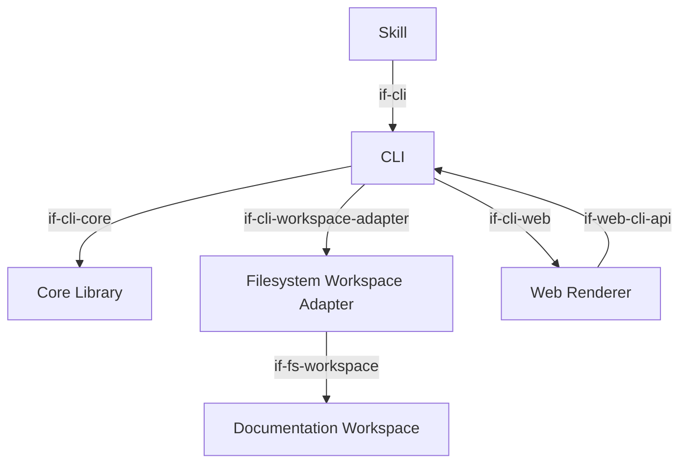
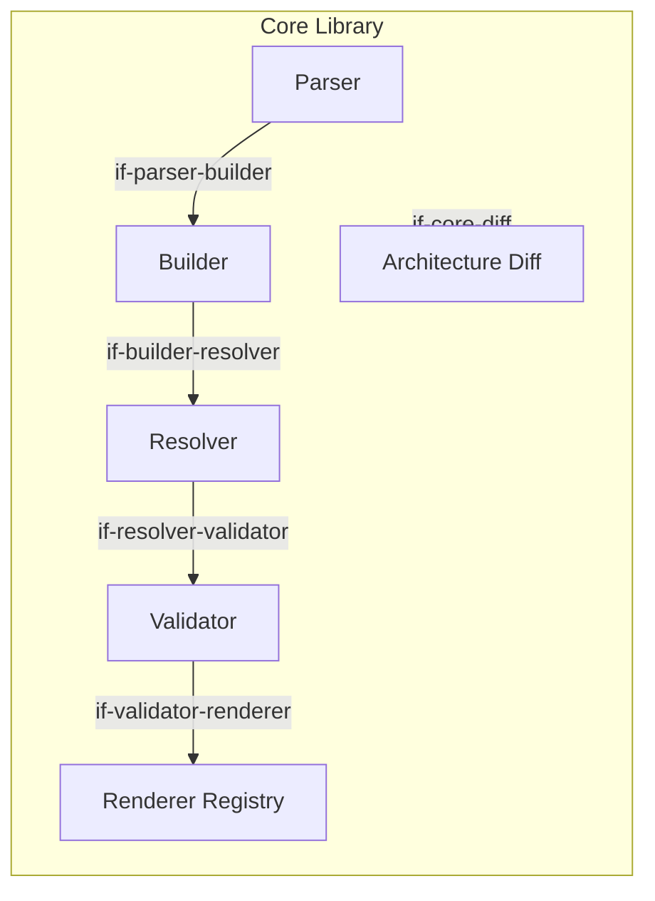

# Building Blocks

The arc42-language toolchain is a pnpm monorepo. Each package is a vertical slice of the system —
the core library owns architecture processing; the CLI and skill are thin consumers of it. Each
building-block diagram uses one abstraction level: the overview shows peer/package-level blocks,
while a parent and its direct children appear only in that parent's adjacent drill-down.

```arc42
:::diagram
id: diag-building-blocks
view: building-block
notation: mermaid
:::
```



The overview intentionally treats `@arc42/core` as opaque. Its internal responsibilities are
shown only in the Core Library drill-down below.

## Core Library

The architecture-processing heart of the system. It transforms already-acquired architecture
documents into a typed model, resolves references, validates the model, renders queries, and
provides the pure architecture-diff analysis used by the CLI. It does not discover files, read
filesystem resources, select repository roots, or watch for changes. Source acquisition belongs to
workspace adapters; the processing pipeline is: parse Markdown → build element model → index
references → validate or render.

```arc42
:::building-block
id: bb-core
title: Core Library
technology: TypeScript / Node.js
implements: concept-pipeline, concept-rule-registry
requires: if-core-diff
path: packages/core
:::
```

The Core Library is decomposed into one parent and its direct logical children. The children are
all internal responsibilities of the same package and are therefore not peer packages in the
overview. Architecture Diff is deliberately shown here, alongside the processing pipeline, but
not in the package-level diagram.

```arc42
:::diagram
id: diag-core-internals
view: building-block
notation: mermaid
:::
```



### Core Library API

The Core Library provides its top-level API to the CLI as a workspace dependency. The CLI consumes
this contract for argument coordination, output formatting, and exit codes; the business logic
remains in Core Library.

```arc42
:::interface
id: if-cli-core
title: Core Library API
provider: bb-core
protocol: TypeScript module import (pnpm workspace:\*)
path: packages/core/src/index.ts
:::
```

---

### Markdown Parser

Reads acquired `.arc42.md` document content line by line and produces a `DocumentAst` — a sequence of heading,
prose, and block nodes with line numbers. Deliberately dumb: it emits all block types including
unknown ones. The meta-model builder rejects what it does not understand. This keeps the parser
stable as the block type set evolves.

```arc42
:::building-block
id: bb-parser
title: Markdown Parser
technology: TypeScript
parent: bb-core
implements: concept-pipeline
requires: if-parser-builder
path: packages/core/src/parser
:::
```

### Meta-model Builder

Turns `DocumentAst[]` into a typed `Workspace` — a flat list of `Element` objects covering quality
goals, constraints, building blocks, interfaces, concepts, decisions, risks, and glossary terms,
plus parse errors for missing or invalid required attributes. Unknown block types and structural
problems are recorded as `ParseError` entries, which the E005 rule surfaces as diagnostics.

```arc42
:::building-block
id: bb-builder
title: Meta-model Builder
technology: TypeScript
parent: bb-core
implements: concept-pipeline
requires: if-builder-resolver
path: packages/core/src/model
:::
```

#### Parser Input Contract

The parser produces `DocumentAst` structs consumed by the builder to construct the workspace model.

```arc42
:::interface
id: if-parser-builder
title: Parser Input Contract
provider: bb-builder
protocol: In-process TypeScript function call
path: packages/core/src/ast.ts
:::
```

### Reference Resolver

Builds a bidirectional reference index from the workspace: `byId` (id → element), `refsFrom`
(id → ids this element references), and `refsTo` (id → ids that reference this element). The index
also owns the canonical semantic edge representation used by query and payload consumers. It is
passed to every validation rule and to the `get` command for 1-hop relationship resolution.

```arc42
:::building-block
id: bb-resolver
title: Reference Resolver
technology: TypeScript
parent: bb-core
implements: concept-pipeline
requires: if-resolver-validator
path: packages/core/src/resolver
:::
```

#### Builder Output Contract

The builder produces a `Workspace`; the resolver consumes it to build the reference index.

```arc42
:::interface
id: if-builder-resolver
title: Builder Output Contract
provider: bb-resolver
protocol: In-process TypeScript function call
path: packages/core/src/model/types.ts
:::
```

### Validator

Runs all registered rules against the workspace and index. Each rule is a self-describing object
with metadata (code, severity, type, description, rationale, arc42 chapter) and a `check()` function.
The validator is simply `builtinRules.flatMap(r => r.check(workspace, index))`. Rules that need
raw AST access use `workspace.documents`.

```arc42
:::building-block
id: bb-validator
title: Validator
technology: TypeScript
parent: bb-core
implements: concept-pipeline, concept-rule-registry
requires: if-validator-renderer
path: packages/core/src/validator
:::
```

#### Resolver Validation Input

The validator receives both the workspace and the reference index from the resolver.

```arc42
:::interface
id: if-resolver-validator
title: Resolver Validation Input
provider: bb-validator
protocol: In-process TypeScript function call
path: packages/core/src/resolver/types.ts
:::
```

### Renderer Registry

Produces human-readable text or JSON from workspace and element query results. Each renderer
implements the `GetRenderer` interface. The registry (`builtinGetRenderers`, `rendererById`)
mirrors the rule registry pattern. Text and JSON are the two built-in formats; graphviz and
HTML are future work.

```arc42
:::building-block
id: bb-renderer
title: Renderer Registry
technology: TypeScript
parent: bb-core
implements: concept-rule-registry
path: packages/core/src/renderer
:::
```

#### Renderer Output Contract

The CLI passes validation results and element queries to the renderer registry for output.

```arc42
:::interface
id: if-validator-renderer
title: Renderer Output Contract
provider: bb-renderer
protocol: In-process TypeScript function call
path: packages/core/src/validator/types.ts
:::
```

### Architecture Diff

Compares current and base architecture documents with a set of changed file ranges. It reports
inconsistencies between prose and architecture blocks and can produce implementation-path hints
when a workspace supplies known source paths. The analysis itself is source-independent and does
not access the filesystem; path knowledge is supplied by the relevant workspace adapter.

```arc42
:::building-block
id: bb-diff
title: Architecture Diff
technology: TypeScript
parent: bb-core
path: packages/core/src/diff.ts
:::
```

#### Architecture Diff Contract

The Core Library exposes Architecture Diff as an internal capability of the package. The CLI
reaches that capability through the opaque Core Library boundary; it does not depend directly on
the child building block.

```arc42
:::interface
id: if-core-diff
title: Architecture Diff Contract
provider: bb-diff
protocol: In-process TypeScript function call
path: packages/core/src/index.ts
:::
```

## Filesystem Workspace Adapter

Provides the filesystem-backed workspace boundary used by the CLI. It discovers architecture
documents, reads their contents, establishes repository-root context, and performs validations that
depend on filesystem paths. Other acquisition mechanisms, such as web resources, can provide their
own adapters without expanding the responsibilities of the architecture-processing core. File
watching and workspace-directory selection remain CLI responsibilities. No separate child
building blocks are modeled here because discovery, loading, and path evidence form one cohesive
adapter boundary at this architectural level.

```arc42
:::building-block
id: bb-workspace-fs
title: Filesystem Workspace Adapter
technology: TypeScript / Node.js
implements: concept-pipeline
requires: if-fs-workspace
path: packages/workspace-fs
:::
```

### Filesystem Adapter Contract

The CLI selects the workspace directory and delegates filesystem-backed discovery, loading, and
path-context operations to the filesystem workspace adapter. File watching remains a CLI concern.

```arc42
:::interface
id: if-cli-workspace-adapter
title: Filesystem Adapter Contract
provider: bb-workspace-fs
protocol: TypeScript module import
path: packages/cli
:::
```

## CLI

A thin entry point over the core library and workspace adapters. Parses arguments with Node.js
`util.parseArgs` (no third-party parser), resolves the workspace directory (`--dir` flag →
`$ARC42_DIR` → cwd), and coordinates the selected workspace adapter with core processing. Implements
five commands: `validate`, `get`, `rules`, `diff`, and `serve`; `diff` selects the workspace and
renders findings acquired by the filesystem workspace adapter through the core diff building block. At build time, the CLI copies the compiled `@arc42/web`
SPA assets into its own `dist/web/` directory so they can be served statically.

```arc42
:::building-block
id: bb-cli
title: CLI
technology: TypeScript / Node.js
implements: concept-pipeline
requires: if-cli-core, if-cli-workspace-adapter, if-cli-web
path: packages/cli
:::
```

### CLI Command Interface

Architects, AI agents, CI pipelines, and the skill invoke the CLI commands provided by this
building block.

```arc42
:::interface
id: if-cli
title: CLI Command Interface
provider: bb-cli
protocol: CLI commands via terminal, Bash, or CI process
path: packages/cli/src/cli.ts
:::
```

### CLI Workspace API

The web renderer fetches the workspace payload from the CLI's HTTP API endpoint (`/api/workspace`).
The CLI obtains that payload through its Core Library boundary. In the static export case the
payload is a JSON file generated during the CLI/web build.

```arc42
:::interface
id: if-web-cli-api
title: CLI Workspace API
provider: bb-cli
protocol: HTTP JSON (serve) or static JSON file (export)
path: packages/web/src/types.ts
:::
```

## Opencode Skill

A single `SKILL.md` file that orients AI agents to the project's arc42 convention. Not code —
it establishes the expectation that every architectural change is reflected in the arc42 files,
and points agents at the CLI to discover current state and rules. Installed by copying to
`~/.opencode/skills/arc42-language/SKILL.md`.

```arc42
:::building-block
id: bb-skill
title: Opencode Skill
technology: Markdown
implements: concept-prose-first
requires: if-cli
path: packages/skill
:::
```

### AI Agent → Skill

The agent loads the installed skill to obtain the authoring convention and validation workflow.

```arc42
:::interface
id: if-agent-skill
title: AI Agent → Skill
provider: bb-skill
protocol: SKILL.md loaded at agent startup
path: packages/skill/SKILL.md
:::
```

## Web Renderer

A browser-side single-page application that renders arc42 documentation as a navigable web UI.
Reads workspace data from the core library via an HTTP API (when served by the CLI) or from a
baked-in JSON file (when published as a static site). Presents prose and DSL blocks together:
prose is shown as formatted text; arc42 element blocks are revealed by clicking a coloured
stripe; Mermaid diagrams are rendered inline. An Agent view toggle shows raw DSL fences for
tooling consumers. Designed to work equally as a `localhost` server and as a GitHub Pages
static deployment.

```arc42
:::building-block
id: bb-web-renderer
title: Web Renderer
technology: TypeScript / React / Vite
implements: concept-prose-first
requires: if-web-cli-api
path: packages/web
:::
```

### Reader → Web UI

The reader opens the rendered architecture documentation in a browser.

```arc42
:::interface
id: if-reader-web
title: Reader → Web UI
provider: bb-web-renderer
protocol: HTTP / browser
path: packages/web/src/App.tsx
:::
```

### Web Renderer Hosting Contract

The CLI hosts the web renderer as a local HTTP server. On `arc42 serve`, it builds the workspace
payload via the core library, exposes it at `/api/workspace`, and serves the web renderer's static
assets.

```arc42
:::interface
id: if-cli-web
title: Web Renderer Hosting Contract
provider: bb-web-renderer
protocol: HTTP (localhost) — static assets + JSON API
path: packages/cli/src/cli.ts
:::
```

## arc42 Documentation Workspace

The set of `.arc42.md` files that make up a project's architecture documentation.
Written by architects and AI agents, read by architects, workspace adapters, and CI pipelines.
They are the input to the toolchain and the primary human-readable output it produces and maintains.

```arc42
:::building-block
id: bb-workspace
title: arc42 Documentation Workspace
technology: Markdown (.arc42.md files)
implements: concept-prose-first, concept-pipeline
path: docs/arc42
:::
```

### Architect → Documentation Workspace

The architect reads and writes the Markdown workspace directly in an editor or during review.

```arc42
:::interface
id: if-architect-workspace
title: Architect → Documentation Workspace
provider: bb-workspace
protocol: Plain text / Markdown editor
path: docs/arc42
:::
```

### AI Agent → Documentation Workspace

The agent reads and writes the Markdown workspace using file tools.

```arc42
:::interface
id: if-agent-workspace
title: AI Agent → Documentation Workspace
provider: bb-workspace
protocol: File Read/Write tools
path: docs/arc42
:::
```

### Documentation Workspace Contract

The filesystem workspace adapter reads `.arc42.md` files from the selected documentation workspace
and supplies their contents and filesystem context to the core processing pipeline.

```arc42
:::interface
id: if-fs-workspace
title: Documentation Workspace Contract
provider: bb-workspace
protocol: File system read (discovery + file content)
path: packages/workspace-fs/src/index.ts
:::
```
