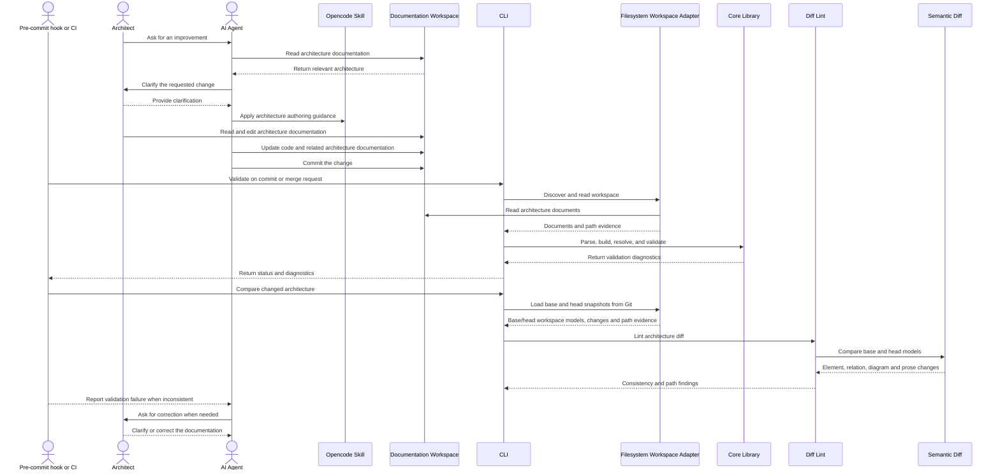
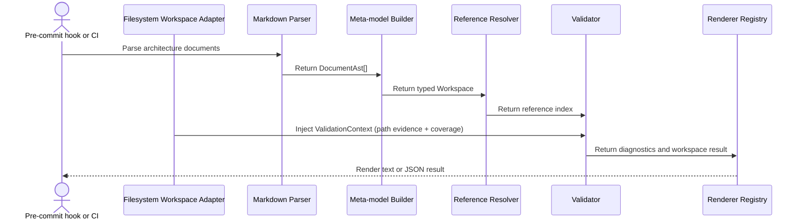
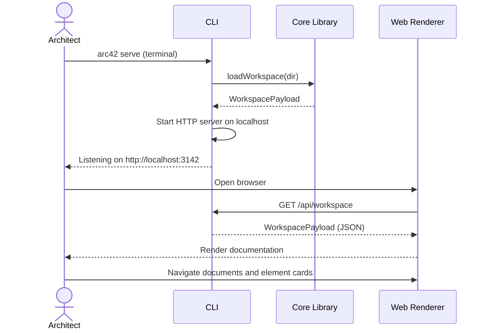
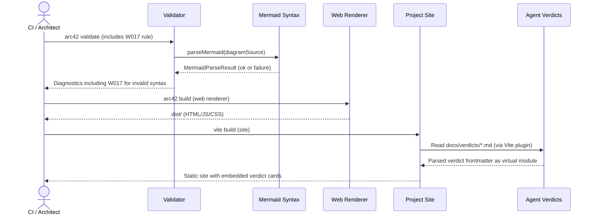
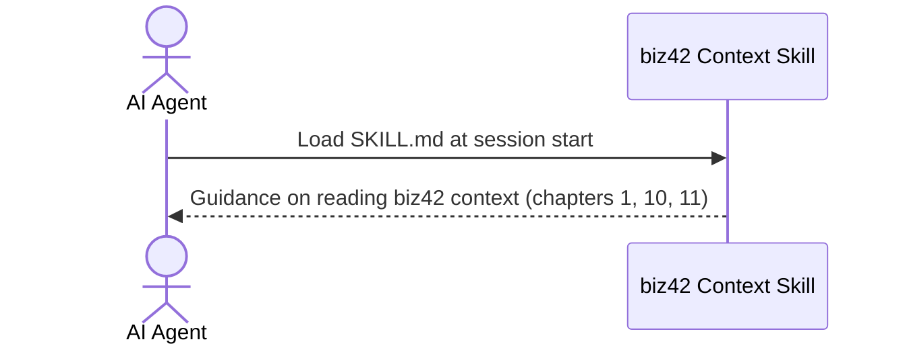
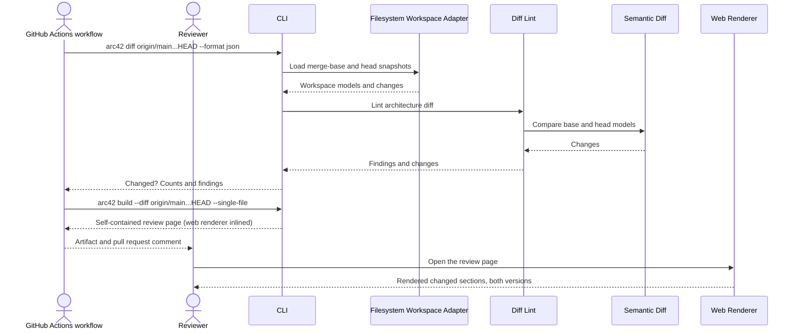

# Runtime View

## Agent-driven Architecture Evolution

This representative Runtime View scenario describes how an architect reads and edits the
architecture workspace with agent assistance. Validation is intentionally shown as an implicit
quality gate at commit or merge time, rather than as a manual step in the architect's workflow.
The diff check loads the base and head snapshots of the change and lints the semantic difference
between the two models, not the changed lines.

```arc42
:::runtime-scenario
id: scenario-agent-architecture-evolution
title: Agent-driven architecture evolution
trigger: An architect asks an agent for an improvement
involves: bb-skill, bb-workspace, bb-cli, bb-core, bb-workspace-fs, bb-diff, bb-semantic-diff
:::
```

```arc42
:::diagram
id: agent-architecture-evolution-sequence
scenario: scenario-agent-architecture-evolution
notation: mermaid-sequence
aliases: bb_skill=bb-skill, bb_workspace=bb-workspace, bb_cli=bb-cli, bb_core=bb-core, bb_workspace_fs=bb-workspace-fs, bb_diff=bb-diff, bb_semantic_diff=bb-semantic-diff
:::
```



The participant identifiers use underscores because Mermaid does not allow hyphens in participant
IDs. The `aliases` field maps each diagram identifier to its model ID. The actors are external
participants and are therefore not included in the scenario's `involves` list. The architect is
the primary reader and editor of the workspace; the agent assists with the change, while the
pre-commit hook or CI pipeline invokes validation implicitly.

## Core model validation pipeline

The validation quality gate delegates to the core pipeline. This schematic scenario makes the
internal hand-offs explicit: parsing produces the document AST, the builder creates the model, the
resolver indexes references, the validator runs rules, and the renderer prepares output.

```arc42
:::runtime-scenario
id: scenario-core-validation-pipeline
title: Core model validation pipeline
trigger: Pre-commit hook or CI invokes architecture validation
involves: bb-parser, bb-builder, bb-resolver, bb-validator, bb-renderer, bb-workspace-fs, bb-core, bb-cli
:::
```

```arc42
:::diagram
id: core-validation-pipeline-sequence
scenario: scenario-core-validation-pipeline
notation: mermaid-sequence
aliases: bb_parser=bb-parser, bb_builder=bb-builder, bb_resolver=bb-resolver, bb_validator=bb-validator, bb_renderer=bb-renderer, bb_workspace_fs=bb-workspace-fs, bb_cli=bb-cli
:::
```



The scenario shows the five interfaces that connect the core pipeline, plus the path context
injected by the filesystem workspace adapter (`if-workspace-paths`). It is a schematic flow, not a claim that each
stage is a separate process or that rendering is required for every validation invocation.

1. A user asks for an improvement.
2. The agent reads the architecture documentation and finds the relevant system architecture.
3. Based on that architecture, the agent enquires with the user to clarify the requested change.
4. The user provides a response.
5. The agent changes the code.
6. The agent updates the architecture documentation, but may miss some aspects of the change.
7. The agent tries to commit the change, and the pre-commit validation checks the architecture
   documentation and reports an error.
8. The agent reads the validation message and returns to the user for clarification or correction.
9. The user responds.
10. The agent updates the architecture consistently with the code and the clarified change.

## Architect browses workspace via arc42 serve

This scenario describes the flow when an architect or reader opens `arc42 serve` to browse a
workspace in the browser. The CLI starts a local HTTP server, the web renderer loads the workspace
payload, and the reader navigates documentation. The `if-reader-web`, `if-cli-web`, and
`if-web-cli-api` interfaces are all exercised in this scenario.

```arc42
:::runtime-scenario
id: scenario-serve-browser
title: Architect browses workspace via arc42 serve
trigger: Architect runs arc42 serve from the terminal
involves: bb-cli, bb-core, bb-web-renderer
:::
```

```arc42
:::diagram
id: serve-browser-sequence
scenario: scenario-serve-browser
notation: mermaid-sequence
aliases: bb_cli=bb-cli, bb_core=bb-core, bb_web=bb-web-renderer
:::
```



The web renderer is a static SPA served from the CLI's distribution directory. The CLI does not
re-parse on every browser request — the workspace payload is loaded once at server startup and
cached in memory for the lifetime of the process.

## Site build with Mermaid validation and verdict loading

This scenario describes the two build-time flows specific to the Project Site and the Mermaid
Syntax building block. During `arc42 validate`, the Validator calls `@arc42/mermaid` to parse
and check Mermaid diagram syntax (W017). Separately, when the Project Site is built, the Verdicts
Vite Plugin reads `docs/verdicts` markdown files and exposes them as a virtual module consumed by
the site's React components.

```arc42
:::runtime-scenario
id: scenario-site-build-verdicts
title: Site build: Mermaid validation and verdict loading
trigger: Architect runs arc42 validate; separately, site build runs
involves: bb-validator, bb-mermaid, bb-site, bb-verdicts, bb-web-renderer
:::
```

```arc42
:::diagram
id: site-build-verdicts-sequence
scenario: scenario-site-build-verdicts
notation: mermaid-sequence
aliases: bb_validator=bb-validator, bb_mermaid=bb-mermaid, bb_site=bb-site, bb_verdicts=bb-verdicts, bb_web_renderer=bb-web-renderer
:::
```



`if-mermaid-syntax` is exercised during `arc42 validate` whenever a diagram block is present.
`if-site-verdicts` is exercised only at site build time — no runtime network calls are involved.
`if-site-docs-output` represents the build artifact produced by `arc42 build` and co-deployed under `/docs/` alongside the project site.

## Agent reads biz42 context skill

When the product this architecture documents is part of a business modeled with biz42, the AI agent
discovers the biz42 context skill at session start and reads it to understand how to consult
business-model context when authoring chapters 1, 10, or 11. No biz42 CLI is invoked and no
data crosses a system boundary — the skill is a Markdown file read directly from disk.

```arc42
:::runtime-scenario
id: scenario-biz42-skill-load
title: Agent reads biz42 context skill
trigger: Agent session starts and a biz42 business model is in scope
involves: bb-skill-biz42-context
:::
```

```arc42
:::diagram
id: biz42-skill-load-sequence
scenario: scenario-biz42-skill-load
notation: mermaid-sequence
aliases: bb_skill_biz42=bb-skill-biz42-context
:::
```



The skill is a static Markdown file installed in the agent's skills directory. Loading it produces
no side effects and involves no network calls, CLI invocations, or biz42 tool interactions. The
skill tells the agent _how_ to read biz42 context — it does not perform that reading itself.

## Pull request architecture review

When a pull request is opened or updated, a GitHub Actions workflow compares the architecture of
each workspace with the merge base of the target branch. Workspaces whose architecture changed are
rendered as one self-contained review page each — every changed section of both versions, the
attribute changes and the lint findings — published as a workflow artifact. A pull request comment
(updated in place on every push) summarizes the changes and links the artifact, so a reviewer sees
the architectural impact at a glance before reading the code diff.

```arc42
:::runtime-scenario
id: scenario-pr-architecture-review
title: Pull request architecture review
trigger: A pull request is opened or updated
involves: bb-cli, bb-workspace-fs, bb-diff, bb-semantic-diff, bb-web-renderer
:::
```

```arc42
:::diagram
id: pr-architecture-review-sequence
scenario: scenario-pr-architecture-review
notation: mermaid-sequence
aliases: bb_cli=bb-cli, bb_workspace_fs=bb-workspace-fs, bb_diff=bb-diff, bb_semantic_diff=bb-semantic-diff, bb_web=bb-web-renderer
:::
```



The workflow lives in `.github/workflows/architecture-review.yml`; its logic is
`scripts/architecture-review.ts`, which can also be run locally. Pull requests from forks receive
a read-only token, so for them the review appears in the job summary instead of a comment.
