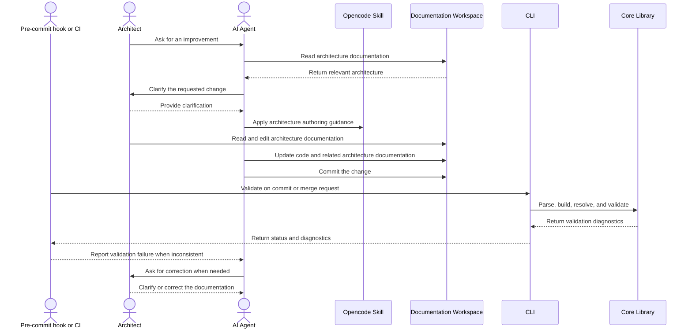
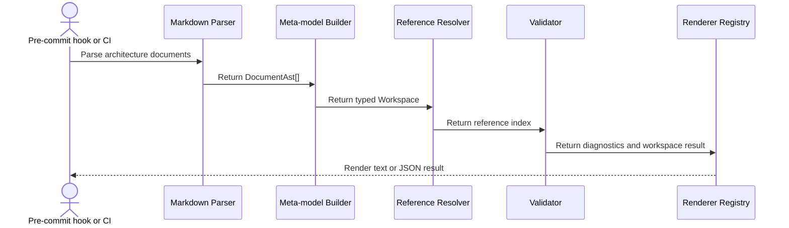
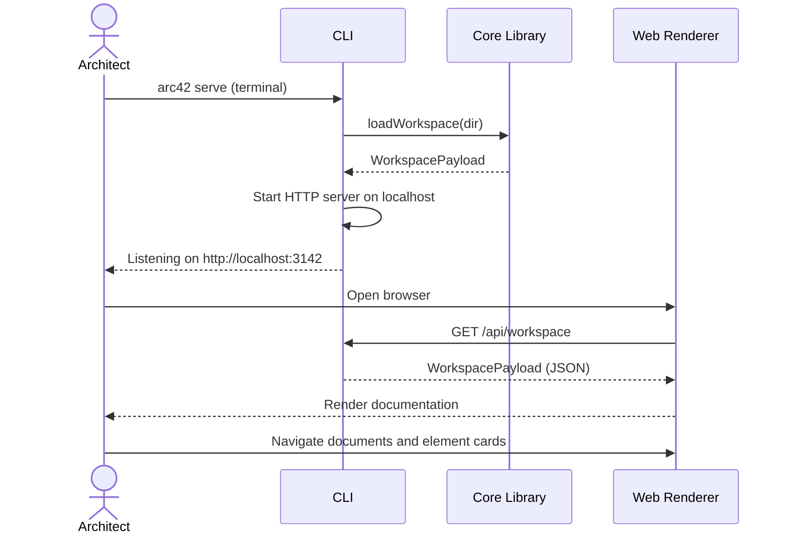

# Runtime View

## Agent-driven Architecture Evolution

This representative Runtime View scenario describes how an architect reads and edits the
architecture workspace with agent assistance. Validation is intentionally shown as an implicit
quality gate at commit or merge time, rather than as a manual step in the architect's workflow.

```arc42
:::runtime-scenario
id: scenario-agent-architecture-evolution
title: Agent-driven architecture evolution
trigger: An architect asks an agent for an improvement
involves: bb-skill, bb-workspace, bb-cli, bb-core
:::
```

:::diagram
id: agent-architecture-evolution-sequence
scenario: scenario-agent-architecture-evolution
notation: mermaid-sequence
aliases: bb_skill=bb-skill, bb_workspace=bb-workspace, bb_cli=bb-cli, bb_core=bb-core
:::



The participant identifiers use underscores because Mermaid does not allow hyphens in participant
IDs. The `aliases` field maps each diagram identifier to its model ID. The actors are external
participants and are therefore not included in the scenario's `involves` list. The architect is
the primary reader and editor of the workspace; the agent assists with the change, while the
pre-commit hook or CI pipeline invokes validation implicitly.

## Core model validation pipeline

The validation quality gate delegates to the core pipeline. This schematic scenario makes the
internal hand-offs explicit: parsing produces the document AST, the builder creates the model, the
resolver indexes references, the validator runs rules, and the renderer prepares output.

```arc42
:::runtime-scenario
id: scenario-core-validation-pipeline
title: Core model validation pipeline
trigger: Pre-commit hook or CI invokes architecture validation
involves: bb-parser, bb-builder, bb-resolver, bb-validator, bb-renderer
:::
```

:::diagram
id: core-validation-pipeline-sequence
scenario: scenario-core-validation-pipeline
notation: mermaid-sequence
aliases: bb_parser=bb-parser, bb_builder=bb-builder, bb_resolver=bb-resolver, bb_validator=bb-validator, bb_renderer=bb-renderer
:::



The scenario intentionally shows the four interfaces that connect the core pipeline. It is a
schematic flow, not a claim that each stage is a separate process or that rendering is required for
every validation invocation.

1. A user asks for an improvement.
2. The agent reads the architecture documentation and finds the relevant system architecture.
3. Based on that architecture, the agent enquires with the user to clarify the requested change.
4. The user provides a response.
5. The agent changes the code.
6. The agent updates the architecture documentation, but may miss some aspects of the change.
7. The agent tries to commit the change, and the pre-commit validation checks the architecture
   documentation and reports an error.
8. The agent reads the validation message and returns to the user for clarification or correction.
9. The user responds.
10. The agent updates the architecture consistently with the code and the clarified change.

## Architect browses workspace via arc42 serve

This scenario describes the flow when an architect or reader opens `arc42 serve` to browse a
workspace in the browser. The CLI starts a local HTTP server, the web renderer loads the workspace
payload, and the reader navigates documentation. The `if-reader-web`, `if-cli-web`, and
`if-web-core` interfaces are all exercised in this scenario.

```arc42
:::runtime-scenario
id: scenario-serve-browser
title: Architect browses workspace via arc42 serve
trigger: Architect runs arc42 serve from the terminal
involves: bb-cli, bb-core, bb-web-renderer
:::
```

:::diagram
id: serve-browser-sequence
scenario: scenario-serve-browser
notation: mermaid-sequence
aliases: bb_cli=bb-cli, bb_core=bb-core, bb_web=bb-web-renderer
:::



The web renderer is a static SPA served from the CLI's distribution directory. The CLI does not
re-parse on every browser request — the workspace payload is loaded once at server startup and
cached in memory for the lifetime of the process.
