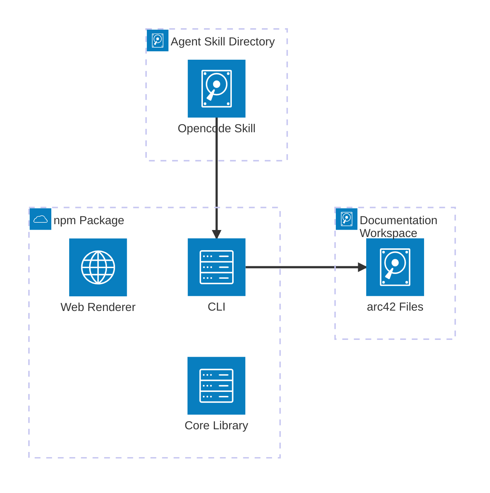
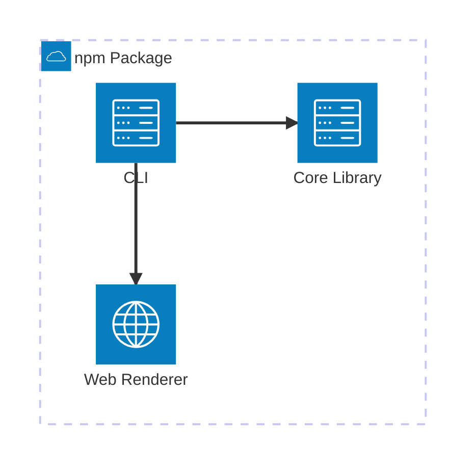

# Deployment View

## Deployment overview

The arc42-language toolchain ships as three independent deployment units: the npm package (CLI,
core library, and web renderer bundled together), the opencode skill, and the author's own arc42
documentation workspace. There is no server, cloud infrastructure, or network dependency beyond
npm for installation.

:::diagram
id: arc42-language-deployment
view: deployment
notation: mermaid-architecture
:::



## npm Package (CLI + Core + Web Renderer)

The CLI, core library, and web renderer are bundled into a single npm package (`@arc42/cli`). The
web renderer's compiled static assets live in `dist/web/` inside the package and are served
directly by the `arc42 serve` command. There is no separate deploy step — the package is consumed
directly from the npm registry.

```arc42
:::deployment-node
id: node-npm-package
title: npm Package (CLI + Core + Web Renderer)
type: server
hosts: bb-cli, bb-core, bb-parser, bb-builder, bb-resolver, bb-validator, bb-renderer, bb-web-renderer
:::
```

:::diagram
id: arc42-language-npm-package
view: deployment
notation: mermaid-architecture
roots: node-npm-package
:::



## Agent Skill

The skill is a single `SKILL.md` file (and its companion templates) installed by file copy into
the AI agent's skills directory, typically `~/.opencode/skills/arc42-language/`. The agent reads
it at session start. No build step or runtime environment is required; Markdown is the only
technology.

```arc42
:::deployment-node
id: node-skill
title: Agent Skill Directory
type: device
hosts: bb-skill
:::
```

## arc42 Documentation Workspace

The `.arc42.md` files live wherever the project's source code lives — a local checkout, a CI
container, or any filesystem the CLI can read. The workspace is not bundled with the toolchain;
it is supplied by the author per project.

```arc42
:::deployment-node
id: node-workspace
title: arc42 Documentation Workspace
type: device
hosts: bb-workspace
:::
```
