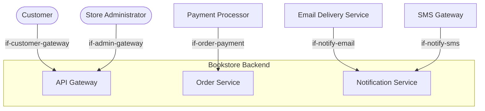

# System Scope and Context

The Bookstore Backend sits at the center of a small ecosystem. External clients (web browsers and mobile apps) interact with it through a single API surface. The system integrates with three external services: a payment processor for charging customers, an email delivery service for transactional notifications, and an SMS gateway for order status updates.

```arc42
:::diagram
id: ctx-view-all
view: context
notation: mermaid
:::
```



Customers browse the catalog, manage their shopping cart, place orders, and review their order history. They interact with the backend indirectly through a web single-page application or a native mobile app. Authentication happens via username/password login, which yields a JWT token for subsequent requests.

```arc42
:::actor
id: actor-customer
title: Customer
type: person
description: End user who browses, searches, and purchases books via web or mobile clients
requires: if-customer-gateway
:::
```

## Store Administrator

Store administrators manage the book catalog — adding new titles, updating prices and stock levels, and removing discontinued items. They use a separate admin interface that calls the same backend API with elevated permissions.

```arc42
:::actor
id: actor-admin
title: Store Administrator
type: person
description: Internal staff who manage the book catalog, inventory, and order fulfillment
requires: if-admin-gateway
:::
```

## Payment Processor (Stripe)

An external payment processing service. The backend sends payment authorization requests during checkout and receives asynchronous webhook callbacks for payment confirmation, failure, and refund events. No card data is stored in the bookstore system — all sensitive payment data lives exclusively at Stripe.

```arc42
:::actor
id: actor-payment
title: Payment Processor
type: system
description: External payment service (Stripe) for authorization, capture, and refund operations
requires: if-order-payment
:::
```

## Email Delivery Service (AWS SES)

An external email delivery service used for transactional messages: order confirmations, shipping notifications, password resets, and account verification emails. The backend sends email requests; delivery tracking and bounce handling are managed by the external service.

```arc42
:::actor
id: actor-email
title: Email Delivery Service
type: system
description: AWS SES for transactional email delivery
requires: if-notify-email
:::
```

## SMS Gateway (AWS SNS)

An external SMS gateway used for time-sensitive notifications: order dispatch alerts and delivery reminders. Usage is limited to high-value order events to control cost.

```arc42
:::actor
id: actor-sms
title: SMS Gateway
type: system
description: AWS SNS for transactional SMS delivery
requires: if-notify-sms
:::
```

## Customer → API Gateway

Customers interact with the backend exclusively through the API Gateway. All requests — catalog searches, cart operations, order placement — enter through this single endpoint.

```arc42
:::ignore H014 This is only a demo for the arc42, code is out of scope:::

:::interface
id: if-customer-gateway
title: Customer → API Gateway
provider: bb-api-gateway
protocol: HTTPS / REST + JSON
:::
```

## Store Administrator → API Gateway

Administrators use the same API Gateway as customers but authenticate with elevated roles. Admin-specific endpoints for catalog management and order oversight are routed through the same entry point.

```arc42
:::ignore H014 This is only a demo for the arc42, code is out of scope:::

:::interface
id: if-admin-gateway
title: Administrator → API Gateway
provider: bb-api-gateway
protocol: HTTPS / REST + JSON
:::
```

## Order Service → Payment Processor

The Order Service calls Stripe during checkout to authorize payment. It also receives asynchronous webhook notifications from Stripe for payment lifecycle events (success, failure, refund).

```arc42
:::ignore H014 This is only a demo for the arc42, code is out of scope:::

:::interface
id: if-order-payment
title: Order Service → Payment Processor
provider: bb-order-service
protocol: HTTPS / REST (Stripe API v2)
:::
```

## Notification Service → Email Delivery

The Notification Service sends transactional emails through AWS SES. It formats messages from templates and hands them to the delivery service for dispatch.

```arc42
:::ignore H014 This is only a demo for the arc42, code is out of scope:::

:::interface
id: if-notify-email
title: Notification Service → Email Delivery
provider: bb-notification-service
protocol: HTTPS / AWS SES API
:::
```

## Notification Service → SMS Gateway

The Notification Service sends SMS messages through AWS SNS for time-sensitive order events. Messages are short-form and do not require rich formatting.

```arc42
:::ignore H014 This is only a demo for the arc42, code is out of scope:::

:::interface
id: if-notify-sms
title: Notification Service → SMS Gateway
provider: bb-notification-service
protocol: HTTPS / AWS SNS API
:::
```
