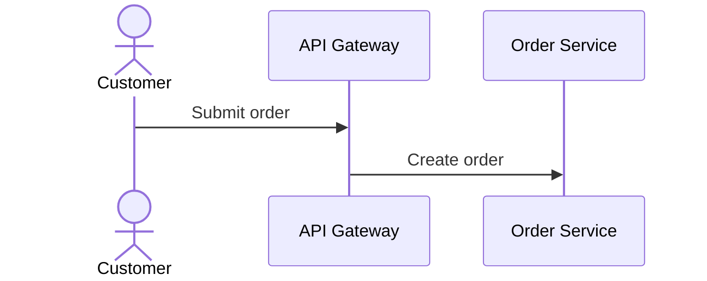

# Runtime View

<!--
Arc42 chapter 6. Document a representative selection of architecturally relevant runtime flows:
important use cases, external interactions, startup/shutdown, administration, and error paths.
Prefer prose-first sections. Explain the trigger, responsibilities, notable interactions, and
success or failure behavior before adding the structured scenario summary.

The `involves` field contains comma-separated building-block IDs. It is optional in the model, but
scenarios without it receive warning W011. Interfaces covered by no scenario receive hint H011.

Example:

## Customer checkout

The customer submits an order. The API validates it, the order service creates the order, and the
payment service authorizes payment before the customer receives confirmation.

```arc42
:::runtime-scenario
id: scenario-checkout
title: Customer checkout
trigger: Customer submits an order
involves: bb-api, bb-order-service, bb-payment-service
:::
```

Mermaid sequence diagrams may be attached using the project's explicit diagram association syntax.
Use model IDs (or explicit safe aliases) for participants and labels only for display:

:::diagram
id: checkout-sequence
scenario: scenario-checkout
notation: mermaid-sequence
:::



State diagrams remain ordinary Markdown artifacts and are not parsed or linted by this feature.
-->
