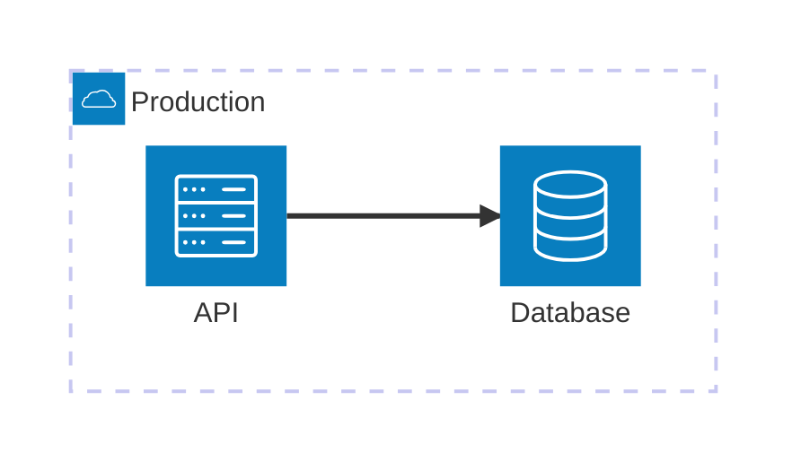

# Deployment View

<!--
Arc42 chapter 7. Describe the infrastructure relevant to the software architecture: environments,
regions, servers, containers, devices, operational boundaries, and the relationships between them.
Explain why the selected deployment topology matters, including important characteristics and
operational prerequisites.

Recommended structure:
1. Open with a deployment overview section that contains the whole-model diagram — readers need
   the big picture before the per-node detail. Use a `:::diagram` block with `view: deployment`
   and `notation: mermaid-architecture` immediately below the introductory prose.
2. Follow with one `##` section per deployment environment or significant infrastructure node.
   Each section ends with a `:::deployment-node` block as the machine-readable summary.
3. Optionally add scoped diagrams (with `roots:`) for important subsystems.

`type` is optional and must be one of `server`, `container`, `device`, `cloud-region`, or
`environment`. `hosts` contains comma-separated building-block IDs. `parent` creates a hierarchy
between deployment nodes. Multiple nodes may host the same building-block, and composite
building-blocks do not need a direct host mapping.

Diagrams are optional named views over the structured nodes and do not create additional model
elements. Omit `roots` for a whole-model overview, or supply deployment-node IDs to scope the
diagram to a subtree. Use explicit `safe-id=model-id` aliases only when a model ID is not a valid
Mermaid identifier.

Example:

## Deployment overview

There are two environments: production and staging. Production is the primary target; staging
mirrors it for pre-release validation.

:::diagram
id: my-system-deployment
view: deployment
notation: mermaid-architecture
:::



## Production

The production environment runs in the primary cloud region. The API and database are co-located
in the same region for low-latency access.

```arc42
:::deployment-node
id: env-production
title: Production
type: environment
hosts: bb-api, bb-database
:::
```

## Staging

Mirrors the production topology for pre-release validation. Uses smaller instance sizes.

```arc42
:::deployment-node
id: env-staging
title: Staging
type: environment
hosts: bb-api, bb-database
:::
```
-->
```
